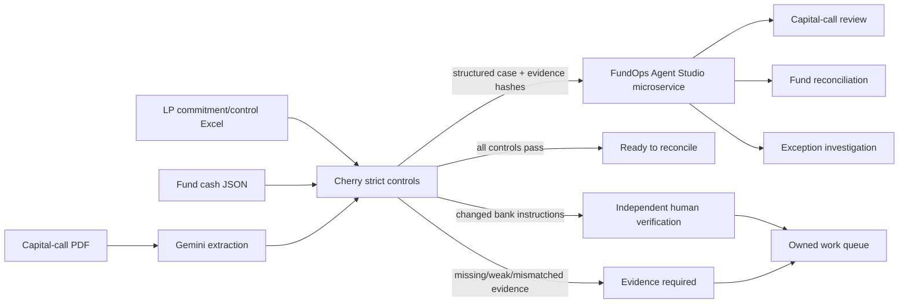

# Cherry FundOps — Capital Call Control Room

[](https://github.com/sohamtech-uk/cherry-agentic-finops/actions/workflows/ci.yml)

Cherry FundOps turns a capital-call notice, LP commitment/control workbook and fund cash evidence
into one governed private-markets case:

**extract → cross-check → reconcile → surface exceptions → route the next action**

The judge-facing experience is prepared for **Rebuild Private Markets: Ylookup × Encode AI
Hackathon**. Gemini interprets the PDF; deterministic Cherry controls decide whether evidence is
strong enough to close, needs more evidence or requires independent human verification.

## Judge-facing input contract

The integrated workflow accepts the three requested source types:

```text
PDF capital-call notice
+ Excel commitment/control workbook
+ JSON fund cash/bank export
                  ↓
POST /api/private-markets/analyse-integrated
```

The response contains:

- Gemini schema-validated extraction;
- strict Cherry commitment/bank/cash controls;
- owned exception work items;
- SHA-256 hashes for all three inputs and the analysis;
- optional FundOps Agent Studio enrichment.

## Architecture



**Control boundary:** Agent Studio enriches the case but does not grant financial authority. Cherry's
deterministic controls remain authoritative, and neither service initiates a payment.

## FundOps Agent Studio microservice

Sunil's `fundops-agent-studio` backend is kept as a separate service instead of copying it into this
repository. Configure:

```env
FUNDOPS_STUDIO_API_URL=https://<fundops-agent-studio-service>
FUNDOPS_STUDIO_AUDIENCE=https://<fundops-agent-studio-service>
FUNDOPS_STUDIO_TIMEOUT_SECONDS=25
```

For private Google Cloud Run, `FUNDOPS_STUDIO_AUDIENCE` enables server-to-server IAM ID-token
authentication. A static `FUNDOPS_STUDIO_API_TOKEN` can be used for local/non-GCP environments.

Cherry calls:

```text
GET  /integration/cherry/health
POST /integration/cherry/capital-call
```

on Agent Studio. If the microservice is unavailable, Cherry still completes its strict local control
analysis and marks Agent Studio enrichment as unavailable rather than failing the financial review.

## Demo scenarios

| Scenario | What happens | Outcome |
| --- | --- | --- |
| Control break | Bank instructions change and booked cash is £500 short | Evidence required; treasury and investor-ops tasks are created |
| Awaiting cash | Notice and approved bank record agree but no strongly referenced receipt exists | Case remains open for investor operations |
| Clean close | Notice, commitment arithmetic, approved bank record and strongly referenced cash agree | Ready to reconcile |

Public synthetic demos:

```text
POST /api/private-markets/demo/exception
POST /api/private-markets/demo/awaiting-cash
POST /api/private-markets/demo/clean
```

## Control principles

- blank or unapproved banking metadata never counts as approval;
- a capital call cannot exceed the LP commitment remaining before the call;
- investor-name-only bank matches are weak evidence and cannot auto-reconcile;
- automatic close requires strong call/LP reference evidence in booked cash;
- duplicate transaction IDs are treated as a control break;
- low-confidence document extraction requires review;
- Cherry FundOps never authorises or executes a payment.

## Cherry Money relationship

Cherry Money is a separate, pre-existing accounting/open-banking product. If organiser rules permit
pre-existing infrastructure, FundOps can use Cherry Money as a **read-only financial system of
record** through its authenticated WebMCP bridge.

```env
CHERRY_MONEY_API_URL=https://cherrymoney.co.uk
CHERRY_MONEY_API_TOKEN=...
```

Protected endpoint:

```text
GET /api/private-markets/cherry-money/snapshot
```

The private-markets workflow never writes to Cherry Money.

## Real PDF + Excel + JSON analysis

```text
POST /api/private-markets/analyse-integrated
```

Multipart inputs:

| Field | Required | Description |
| --- | --- | --- |
| `capital_call` | yes | capital-call PDF |
| `commitments` | yes | LP commitment/control `.xlsx` |
| `fund_json` | yes | UTF-8 cash/bank `.json` |
| `as_of_date` | no | `YYYY-MM-DD` control date |

In production, real uploads fail closed until `CHERRY_PRIVATE_MARKETS_UPLOAD_TOKEN` is configured.
Clients send it as `X-Cherry-Demo-Token`. The token is not persisted by the browser UI.

The previous CSV/structured fallback endpoint remains available at
`POST /api/private-markets/analyse` for backwards compatibility.

## JSON cash shapes

The integrated JSON parser accepts either a top-level transaction array or:

```json
{
  "transactions": [
    {
      "transaction_id": "TXN-1",
      "booking_date": "2026-09-05",
      "direction": "credit",
      "amount": 1249500,
      "currency": "GBP",
      "counterparty": "Oakfield Pension Trust",
      "reference": "NCGFIII-CALL-2026-03 / LP-001",
      "status": "BOOKED"
    }
  ]
}
```

Common aliases such as `id`, `date`, `value_date`, `amount_gbp`, `payment_reference` and `narrative`
are normalised before strict validation.

## NAV Quality Controller

A second, independent deterministic reviewer for a fund administrator's NAV pack, targeting the
top problem identified from the sponsor call transcripts: a draft NAV that takes several review
rounds before a manager can trust it.

```text
POST /api/nav-quality/review
```

Multipart inputs:

| Field | Required | Description |
| --- | --- | --- |
| `nav_summary` | yes | administrator's reported NAV summary `.json` (balance sheet, NAV bridge, investor capital) |
| `source_ledger` | no | investor-level GL export `.xlsx`, to independently recompute the balance sheet, NAV and investor capital |
| `side_letter_rules` | no | structured side-letter terms `.json` (e.g. management fee offsets called capital) |

Every check is plain `Decimal` arithmetic, never an LLM: does the balance sheet foot to equity, does
the NAV bridge (opening + contributions + investment movement + income − expenses − distributions)
foot to the reported closing NAV, does an independent recalculation from the source ledger agree with
the reported NAV, does each investor's capital account agree with the ledger (and any side-letter
term that applies to it)? The response is a recommended action
(`ready_to_submit` / `needs_review` / `return_to_administrator`) plus findings, work items and
SHA-256 evidence hashes for every input — it never posts a correcting entry or amends the NAV itself.

This ships as a standalone endpoint (see `/api/docs`); it is not yet wired into the shared
auto-detect upload form described above.

## Run locally

Python 3.11+:

```bash
git clone git@github.com:sohamtech-uk/cherry-agentic-finops.git
cd cherry-agentic-finops
python3 -m venv .venv
source .venv/bin/activate
python -m pip install -e ".[dev]"
cp .env.example .env
uvicorn app.api:app --reload --port 8080
```

Useful URLs:

```text
http://localhost:8080
http://localhost:8080/api/docs
http://localhost:8080/api/private-markets/health
http://localhost:8080/api/private-markets/integration/health
http://localhost:8080/api/nav-quality/health
```

Generate backup fixtures:

```bash
make ylookup-fixtures
```

This creates both CSV and JSON cash fixtures; the integrated workflow uses the JSON version.

## Quality gates

```bash
ruff check .
ruff format --check .
mypy app agents
pytest
python -m compileall -q app agents
node --check app/static/app.js
docker build --tag cherry-agent:test .
```

## Deployment

Cherry's target is `https://finops.cherrymoney.co.uk` on Google Cloud Run. The deployment workflow
accepts the Agent Studio URL/audience as GitHub environment variables and uses the existing Cherry
runtime service account for server-to-server invocation.

Agent Studio should be deployed separately as a **private Cloud Run service** backed by the existing
PostgreSQL/Cloud SQL instance (preferably a dedicated `fundops` database on that instance).

## Repository map

```text
app/private_markets.py                       private-markets schemas and Excel/CSV parsing
app/private_markets_strict.py                fail-closed deterministic controls
app/private_markets_io.py                    JSON cash parser
app/private_markets_router.py                legacy/demo and Cherry Money routes
app/private_markets_integration_router.py    PDF + Excel + JSON orchestration
app/nav_quality.py                           NAV Quality Controller schemas, GL parser and checks
app/nav_quality_router.py                    NAV Quality Controller endpoint
app/fundops_studio.py                        Agent Studio microservice client
app/static/                                  judge-facing control-room UI
fixtures/private_markets/                    synthetic backup data
scripts/                                     fixture/deployment helpers
tests/                                       controls, API and integration tests
```

## Reuse disclosure

This repository contains pre-existing Cherry Agent work and pre-event Ylookup preparation. The frozen
pre-hardening state remains at `baseline/pre-hardening-2026-09-05` on commit
`22f4461ee793eb9d9ab83828f9992a76c0be3ef6`. Do not represent pre-existing work as code built after
hackathon kickoff. See `PREEXISTING_CODE.md` for details.

## Licence

Apache-2.0. Copyright 2026 Soham London CIC.
