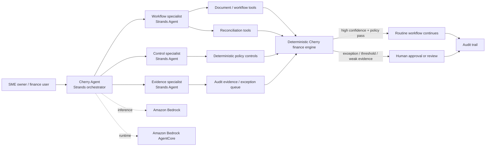

# Cherry Agent: Autonomous Finance Ops for SMEs

[](https://github.com/sohamtech-uk/cherry-agentic-finops/actions/workflows/ci.yml)

Cherry Agent is a **Strands Agents SDK** finance-operations system for small businesses. It uses
Amazon Bedrock for agent reasoning and specialist delegation, while deterministic Cherry controls
remain authoritative for reconciliation, policy outcomes and audit evidence.

The product goal is simple: automate routine finance administration and involve a human only when a
real decision, exception or approval is required.

> **Agent orchestration where AI helps; deterministic controls where finance requires certainty.**

## Agents for Humans hackathon build

This branch is the AWS / **Professional Agents** version of Cherry Agent.

The new hackathon layer is implemented in:

```text
agents/cherry_strands/agent.py   Strands orchestrator + specialist agents + bounded tools
agentcore/cherry_agent.py        Amazon Bedrock AgentCore Runtime entrypoint
```

The Strands implementation deliberately reuses the repository's existing deterministic finance
engines rather than asking a model to perform accounting arithmetic itself.

### NEW FOR AGENTS FOR HUMANS

- Strands Agents SDK orchestration and specialist Strands agents
- Amazon Bedrock model integration
- AgentCore-compatible runtime and dedicated AWS deployment tooling
- Dedicated `/api/strands/health` and `/api/strands/invoke` endpoints

### PRE-EXISTING / REUSED

- Cherry deterministic finance engine
- Pre-existing Google ADK work
- Pre-existing Ylookup/FundOps logic
- Cherry Money product/infrastructure

Strands = orchestration. Cherry deterministic engine = financial authority.
Human = approval authority.

### What Strands does

- receives the user's finance-operations request;
- decides which specialist agent should handle it;
- calls bounded finance tools;
- explains workflow outcomes and exceptions;
- delegates control explanations and evidence summaries to specialist agents;
- stops when the deterministic workflow requires human review.

### NEW FOR AGENTS FOR HUMANS

- Strands Agents SDK orchestration and specialist Strands agents
- Amazon Bedrock model integration
- AgentCore-compatible runtime and dedicated AWS deployment tooling
- Dedicated `/api/strands/health` and `/api/strands/invoke` endpoints

### PRE-EXISTING / REUSED

- Cherry deterministic finance engine
- Pre-existing Google ADK work
- Pre-existing Ylookup/FundOps logic
- Cherry Money product/infrastructure

Strands = orchestration. Cherry deterministic engine = financial authority.
Human = approval authority.

### What Strands does **not** do

- invent transactions or supporting evidence;
- override a failed deterministic control;
- infer human consent;
- approve a workflow on a person's behalf;
- initiate a bank payment or alter bank instructions.

## Architecture



## Strands multi-agent pattern

The AWS build uses the Strands **Agents as Tools** pattern:

1. **Cherry Agent orchestrator** receives the user's objective.
2. **Workflow specialist** runs or inspects bounded finance workflows.
3. **Control specialist** explains deterministic control outcomes and escalation reasons.
4. **Evidence specialist** summarises audit evidence and open exceptions.
5. The orchestrator returns one clear response without giving the model financial authority.

The implementation creates a fresh hierarchy per invocation so conversation state is not shared
between unrelated users.

## Human-in-the-loop boundary

Human approval is intentionally **not exposed as an LLM tool** in the Strands layer. If a finance
workflow is paused for approval, Cherry Agent reports the reason and the evidence required. The
existing explicit approval API/UI remains the authority for recording the human decision.

That means the model cannot simply set `approved=true` to complete its own task.

## Safe demo scenarios

The Strands workflow can call the repository's synthetic finance scenarios:

| Scenario | Purpose | Expected behaviour |
| --- | --- | --- |
| `autonomous` | Clean, high-confidence routine case | Deterministic policy can complete the routine reconciliation |
| `approval` | Case above an approval boundary | Agent stops and explains the required human action |
| `exception` | Missing/mismatched evidence | Agent surfaces the exception rather than guessing |

Example prompt for the AgentCore runtime:

```json
{
  "prompt": "Run an approval scenario. Explain what Cherry Agent automated, which deterministic control stopped the workflow, and what the human needs to review."
}
```

## AWS runtime

The hackathon target is:

```text
Strands Agents SDK
        ↓
Amazon Bedrock
        ↓
Amazon Bedrock AgentCore Runtime
        ↓
Cherry deterministic finance tools
```

Default development configuration:

```env
AWS_REGION=eu-west-2
STRANDS_BEDROCK_MODEL_ID=eu.anthropic.claude-sonnet-4-6
```

For local development, authenticate with your own AWS CLI/SSO profile. Do **not** commit AWS access
keys or session credentials.

See [`docs/AWS_AGENTCORE_DEPLOYMENT.md`](docs/AWS_AGENTCORE_DEPLOYMENT.md) for the deployment checklist.

## Run the Strands agent locally

Python 3.11+ is required.

```bash
git clone git@github.com:sohamtech-uk/cherry-agentic-finops.git
cd cherry-agentic-finops
git checkout feat/agents-for-humans-strands-aws

python3 -m venv .venv
source .venv/bin/activate
python -m pip install -e ".[dev]"

export AWS_REGION=eu-west-2
export STRANDS_BEDROCK_MODEL_ID=eu.anthropic.claude-sonnet-4-6
```

Then invoke from Python:

```bash
python - <<'PY'
from agents.cherry_strands import invoke_cherry_agent

result = invoke_cherry_agent(
    "Run an exception scenario and explain why a human must review it."
)
print(result["response"])
PY
```

## AgentCore entrypoint

The checked-in runtime entrypoint is:

```text
agentcore/cherry_agent.py
```

It uses `BedrockAgentCoreApp` and accepts:

```json
{"prompt": "..."}
```

The response includes the agent answer plus the framework, Bedrock model ID, AWS region and the
financial safety boundary.

## Existing product capabilities reused as bounded tools

The repository already contains finance-domain code for:

- invoice/document analysis;
- bank and GL reconciliation;
- deterministic reconciliation scoring;
- policy thresholds and exception routing;
- human approval state management;
- append-only audit evidence;
- NAV and private-markets controls;
- statement review and contract evidence;
- read-only Cherry Money integration.

For this hackathon those capabilities are **tools and deterministic controls behind the new Strands
agent layer**. They should not be represented as newly written AWS hackathon code.

## Pre-existing work / reuse disclosure

This repository predates Agents for Humans and was previously used for Google ADK/Gemini and the
Ylookup × Encode private-markets build. The historical implementation remains in
`agents/cherry_finops/agent.py` and related modules.

The new Agents-for-Humans work is intentionally separated in `agents/cherry_strands/` and
`agentcore/`. See [`PREEXISTING_CODE.md`](PREEXISTING_CODE.md) for the detailed disclosure.

## Legacy Ylookup / Cherry FundOps work

The existing private-markets implementation remains available, including:

```text
POST /api/private-markets/analyse-integrated
POST /api/nav-quality/review
POST /api/statement-review/compare
```

It includes capital-call controls, NAV quality checks, contract evidence, statement review,
exception prioritisation and read-only Cherry Money context. Those features are useful domain tools
for Cherry Agent but are not presented as newly created Strands functionality.

The previous Ylookup demo video is retained only as historical evidence of that earlier build:

https://youtu.be/Gyk8k4IRZW4

## Quality gates

```bash
ruff check .
ruff format --check .
mypy app agents
pytest
python -m compileall -q app agents agentcore
node --check app/static/app.js
docker build --tag cherry-agent:test .
```

## Repository map

```text
agents/cherry_strands/agent.py                NEW: Strands orchestrator and specialist agents
agentcore/cherry_agent.py                     NEW: AgentCore Runtime entrypoint
agents/cherry_finops/agent.py                 pre-existing Google ADK agent hierarchy
app/agent_tools.py                            bounded deterministic finance tool surface
app/workflow.py                               policy / human-review state machine
app/private_markets*                          pre-existing private-markets controls
app/nav_quality*                              pre-existing NAV quality controls
app/static/                                   product / demo UI
PREEXISTING_CODE.md                           reuse disclosure
```

## Devpost

**Track:** Professional Agents (Agents for Humans).

**Built with:** Strands Agents SDK, Amazon Bedrock, Amazon Bedrock AgentCore, Python,
FastAPI, Pydantic, Docker, and deterministic financial controls.

Demo: autonomous routine reconciliation; human approval required; evidence exception / refusal to
 guess. See the AWS deployment guide for live verification commands and deployment prerequisites.

## Licence

Apache-2.0. Copyright 2026 Soham London CIC.
