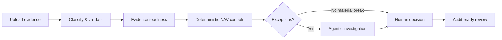
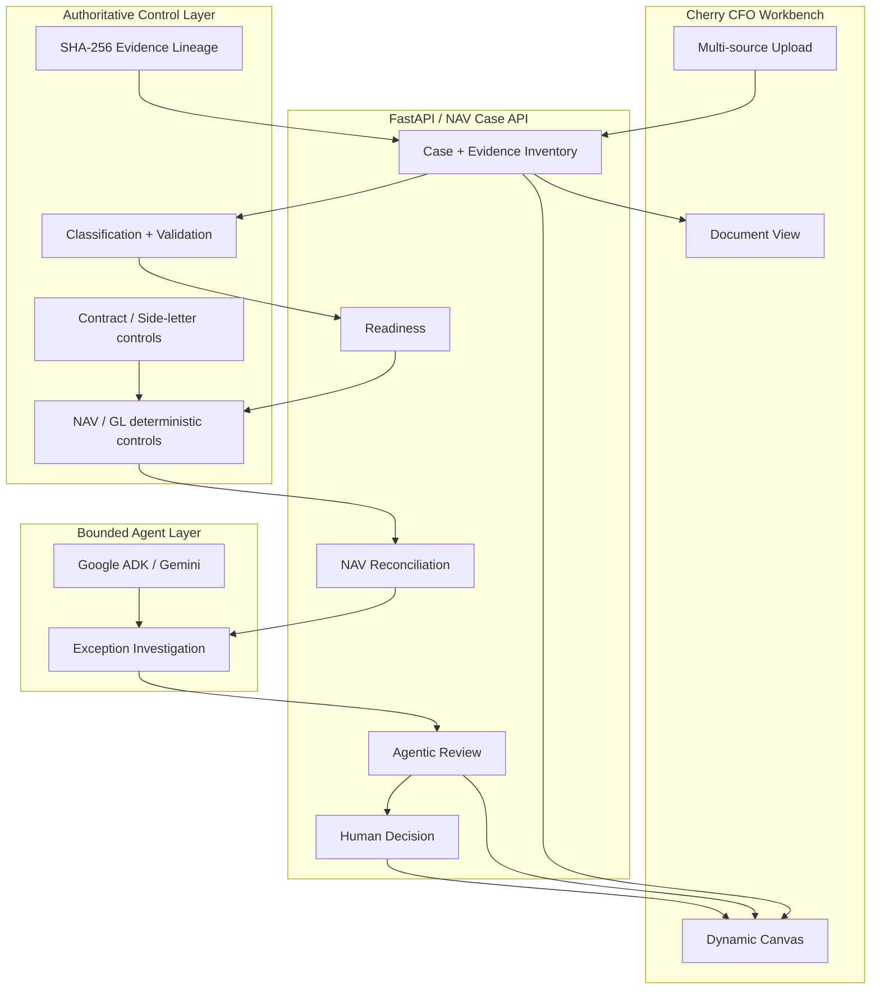

# Cherry CFO — Autonomous NAV Quality Controller

[](https://github.com/sohamtech-uk/cherry-agentic-finops/actions/workflows/ci.yml)

**Syndicate by Maximor · Track 2 — Autonomous Office of the CFO**

**Live demo:** https://cherry-cfo-canvas.vercel.app

Cherry CFO turns a fragmented NAV close pack into a governed finance workflow:

**evidence intake → readiness → deterministic NAV controls → agentic exception review → human decision → audit trail**

> **AI understands. Deterministic controls verify. AI investigates. Humans decide.**

The final Syndicate experience is a **NAV Quality Controller for fund-finance teams**. A controller can upload evidence from multiple sources, see what Cherry recognised, run only the controls supported by that evidence, investigate exceptions, and record an explicit human sign-off decision in one visual workspace.

## Why this exists

A NAV review is rarely one calculation. Controllers receive administrator files, investor-level GL exports, statements, side-letter rules and supporting evidence in different formats and at different times. The real work is deciding:

- what evidence is actually present;
- which controls can safely run;
- what reconciles and what does not;
- which issues are evidence gaps versus financial breaks;
- what should go back to the administrator; and
- whether a human has enough support to sign off.

Cherry CFO is designed around that workflow rather than around a generic finance chatbot.

## Judge-facing workflow



### 1. Upload evidence

The workbench accepts multiple files and multiple selection batches, including:

- administrator NAV evidence;
- investor-level GL workbooks;
- Excel / CSV / JSON data;
- financial statements;
- side-letter / contract evidence;
- bank or custodian evidence;
- PDF, TXT, Markdown and ZIP supporting files.

The public Vercel demo also compacts oversized Excel evidence in the browser and can send evidence as smaller requests to stay within hosted request limits.

### 2. Evidence readiness

Cherry classifies every source and builds an evidence inventory. Missing information is not invented. Readiness explicitly shows which controls are supported and which depend on evidence that is not yet present.

A recognised investor-level GL can support a **partial source review** even when an administrator NAV summary is missing. The missing summary remains an evidence gap rather than being fabricated.

### 3. Deterministic NAV controls

Financial authority stays in deterministic code. Supported controls include NAV / balance-sheet checks, investor-GL validation, source-ledger comparisons and other evidence-backed finance checks.

The language model does not create authoritative NAV figures and cannot turn a missing input into a pass.

### 4. Agentic exception review

The agent works over the deterministic findings to help a controller understand:

- likely root causes;
- related exceptions;
- evidence gaps;
- recommended remediation; and
- the next supported human action.

The agent may explain and consolidate a result. It cannot overwrite the deterministic result.

### 5. Human judgement

The final decision belongs to a person. Current NAV decision routes include:

- **Approve NAV**
- **Approve with exception**
- **Request evidence**
- **Return to administrator**
- **Escalate**

Cherry CFO does not silently amend an official NAV, post a correcting ledger entry, or initiate a payment.

## Dynamic Canvas + Document workspace

The Syndicate UI is intentionally different from a conventional dashboard.

**Canvas mode** turns uploaded evidence and generated finance state into draggable, connected cards. A reviewer can inspect source classification, evidence lineage, controls, exceptions, agent review and the human decision as one visual control map.

**Document mode** renders the same case as a controller-friendly review containing the evidence pack, NAV controls, findings and decision.

The key interaction is:

```text
Upload the close pack
        ↓
Cherry builds the evidence map
        ↓
Run supported deterministic controls
        ↓
Investigate exceptions
        ↓
Human signs off / requests evidence / escalates
```

## Architecture



### Control boundary

- **AI interprets and coordinates.**
- **Deterministic code calculates and validates.**
- **Human reviewers retain final financial judgement.**
- **Evidence lineage remains visible.**
- **No production payment initiation or official-NAV write is exposed by the Syndicate workbench.**

## NAV case API

The judge-facing case flow uses:

```text
POST /api/fund-manager/cases
POST /api/fund-manager/cases/{case_id}/evidence
GET  /api/fund-manager/cases/{case_id}
POST /api/fund-manager/cases/{case_id}/nav/readiness
POST /api/fund-manager/cases/{case_id}/nav/reconcile
POST /api/fund-manager/cases/{case_id}/nav/review
POST /api/fund-manager/cases/{case_id}/nav/decision
```

The repository also contains specialist and pre-existing finance-control modules. They remain available for compatibility, but the **Syndicate submission is framed around the NAV Quality Controller workflow above**.

## Agent orchestration and observability

Syndicate requires AO to be used during the build. The repository keeps explicit evidence of the engineering sessions and post-kickoff work:

- [`SYNDICATE_BUILD_LOG.md`](SYNDICATE_BUILD_LOG.md)
- [`SYNDICATE_TRACK2_PLAN.md`](SYNDICATE_TRACK2_PLAN.md)
- [`SYNDICATE_DOMAIN_RESEARCH.md`](SYNDICATE_DOMAIN_RESEARCH.md)
- [`SYNDICATE_EVALS.md`](SYNDICATE_EVALS.md)
- [`AO_SESSION_01_CFO_WORKFLOW.md`](AO_SESSION_01_CFO_WORKFLOW.md)

AO coordinated focused engineering sessions; Codex was used for implementation/review work. The codebase also includes **Neatlogs** instrumentation for agent tracing where configured.

## Hackathon boundary / pre-existing code

The official Syndicate build started at **2026-09-05 17:00 Europe/London**. The recorded pre-kickoff repository baseline is:

```text
811420327923a8c20795fd72bf221aab0a534bad
```

Everything reachable from that baseline is treated as pre-existing work. See [`SYNDICATE_BUILD_LOG.md`](SYNDICATE_BUILD_LOG.md) and [`PREEXISTING_CODE.md`](PREEXISTING_CODE.md) for the lineage boundary.

The source tree still contains some modules and fixture names created for earlier private-markets work (including `ylookup_*`). Those names are retained for compatibility and provenance; **they are not the current Syndicate product positioning**.

## Run locally

Python 3.11+:

```bash
git clone https://github.com/sohamtech-uk/cherry-agentic-finops.git
cd cherry-agentic-finops
git switch ui/syndicate-cfo-canvas
python3 -m venv .venv
source .venv/bin/activate
python -m pip install -e ".[dev]"
cp .env.example .env
uvicorn app.api:app --reload --port 8080
```

Then open:

```text
http://localhost:8080
http://localhost:8080/api/docs
```

For Gemini-backed agent stages, configure the Google provider described in [`docs/LOCAL_SETUP.md`](docs/LOCAL_SETUP.md). Deterministic NAV controls and much of the UI remain usable without model access.

## Quality gates

```bash
ruff check .
ruff format --check .
mypy app agents
pytest
python -m compileall -q app agents
node --check app/static/cfo_canvas.js
node --check app/static/cfo_canvas_patch.js
docker build --tag cherry-cfo:test .
```

## Documentation

Start with [`docs/README.md`](docs/README.md).

Key guides:

- [Syndicate readiness & submission boundary](docs/SYNDICATE_READINESS.md)
- [System architecture](docs/ARCHITECTURE.md)
- [Website and NAV workflow](docs/WEBSITE_SYSTEM_AND_WORKFLOW.md)
- [2-minute demo script](docs/DEMO_SCRIPT.md)
- [Local setup](docs/LOCAL_SETUP.md)
- [Hackathon build story](docs/HACKATHON_BLOG.md)

## Project principle

Cherry CFO is not designed to be an unrestricted autonomous accountant.

It is designed to remove repetitive finance investigation **without hiding uncertainty or taking financial authority away from the controller**.

> **Cherry CFO does the finance work required to reach a decision. Humans remain responsible for the decisions that matter.**
