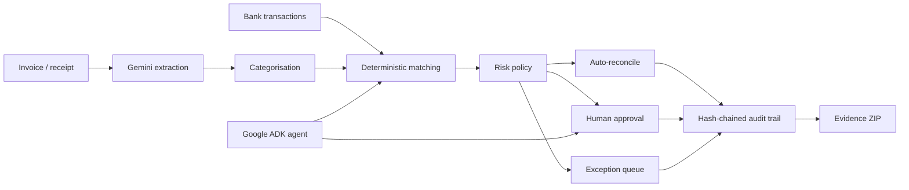

# Cherry Agent — Autonomous Finance Ops

Cherry Agent turns bills, receipts and bank-feed events into governed finance workflows:

**extract → categorise → reconcile → approve when needed → produce audit evidence**

It is a new hackathon implementation built with **Gemini**, **Google Agent Development Kit
(ADK)**, **FastAPI** and **Google Cloud**. The demo works locally without credentials using
explicitly labelled synthetic data; real uploads use Gemini when Google credentials are set.

## Why this is agentic

A financial event starts the workflow. Cherry Agent calls tools, ranks evidence, applies control
policies, pauses for human judgment when required, resumes after approval and creates a durable
audit record. The model does not decide its own financial authority.

Three built-in scenarios make the safety boundary visible:

| Scenario | Outcome |
|---|---|
| Autonomous | Exact low-value match is auto-reconciled |
| Approval | Exact high-value match pauses for a human |
| Exception | Material amount mismatch requests evidence |

## Architecture



The existing Cherry Money codebase already contains invoices, expenses, receipt scanning,
open-banking data and rule-based matching. This repository intentionally implements the
hackathon agent as a separate service with a narrow optional connector rather than copying the
Laravel monolith. See [PREEXISTING_CODE.md](PREEXISTING_CODE.md).

## Run locally

```bash
git clone git@github.com:sohamtech-uk/cherry-agentic-finops.git
cd cherry-agentic-finops

python3.11 -m venv .venv
source .venv/bin/activate
pip install -e ".[dev]"
cp .env.example .env

uvicorn app.api:app --reload --port 8080
```

Open <http://localhost:8080> and run the three scenarios.

Tests and linting:

```bash
ruff check .
ruff format --check .
pytest
```

Docker:

```bash
cp .env.example .env
docker compose up --build
```

## Run the Google ADK agent

ADK discovers `app/agent.py`, which exports `root_agent`.

```bash
# Gemini Developer API
export GOOGLE_API_KEY=your-key

# Or Vertex AI
export GOOGLE_GENAI_USE_VERTEXAI=true
export GOOGLE_CLOUD_PROJECT=your-project
export GOOGLE_CLOUD_LOCATION=global

adk web
# or, with Google's lifecycle CLI:
agents-cli playground
```

Example prompts:

- `Run the autonomous finance scenario and explain why it was safe.`
- `Run the approval scenario and tell me which control stopped automation.`
- `Inspect workflow wf_... and summarise its audit evidence.`

The model is configurable through `CHERRY_GEMINI_MODEL` and defaults to
`gemini-3.6-flash`. Confirm that this model is enabled in the hackathon project before deployment.

## Upload a real invoice or receipt

The API accepts a PDF/image plus bank candidates:

```bash
curl -X POST http://localhost:8080/api/workflows \
  -F 'document=@invoice.pdf;type=application/pdf' \
  -F 'transactions_json=[{"booking_date":"2026-08-22","amount":2450,"currency":"GBP","description":"OFFICE SOLUTIONS INV-98214","merchant_name":"Office Solutions Co.","reference":"INV-98214"}]'
```

With Google credentials configured, Gemini produces structured invoice data. Without credentials,
the local demo uses a clearly marked fallback only when `CHERRY_ALLOW_DEMO_FALLBACK=true`.

## Human-governed controls

The deterministic risk policy blocks silent automation when it sees:

- a currency mismatch;
- an already-reconciled bank transaction;
- an amount variance above 2%;
- a value above the configured approval threshold;
- a match below the configured confidence threshold.

The service reconciles accounting records only. It does **not** initiate or authorise payments.

## Evidence pack

Every state transition is appended to a SHA-256 hash chain. The evidence endpoint generates a ZIP
containing a manifest, extracted invoice, ranked bank candidates, risk decision and audit trail:

```text
GET /api/workflows/{workflow_id}/evidence
```

## Deploy to Google Cloud

The Terraform stack under `infra/terraform` provisions the hackathon baseline:

- Cloud Run
- Artifact Registry
- Vertex AI API access
- Firestore database
- Cloud Storage evidence bucket
- Pub/Sub topic
- dedicated runtime service account and least-privilege IAM

Build and deploy with Cloud Build:

```bash
gcloud builds submit --config cloudbuild.yaml \
  --substitutions=_REGION=europe-west2,_REPOSITORY=cherry-agent,_SERVICE=cherry-agent
```

Or use Terraform after publishing the image:

```bash
cd infra/terraform
terraform init
terraform apply \
  -var="project_id=YOUR_PROJECT" \
  -var="container_image=europe-west2-docker.pkg.dev/YOUR_PROJECT/cherry-agent/cherry-agent:TAG"
```

See [docs/ARCHITECTURE.md](docs/ARCHITECTURE.md) and
[docs/DEMO_SCRIPT.md](docs/DEMO_SCRIPT.md).
