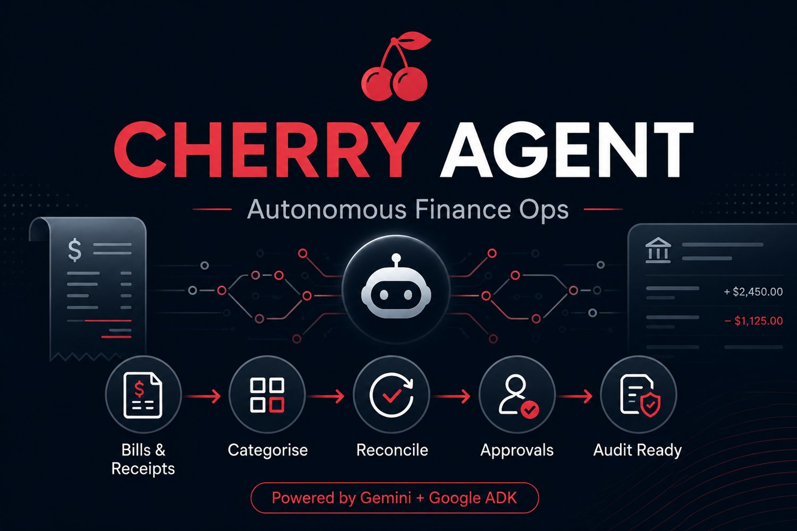
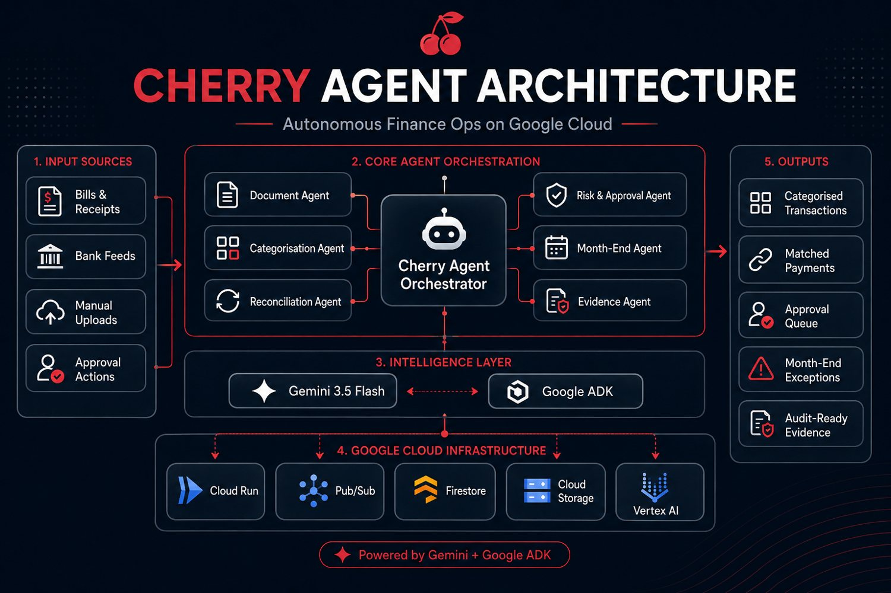
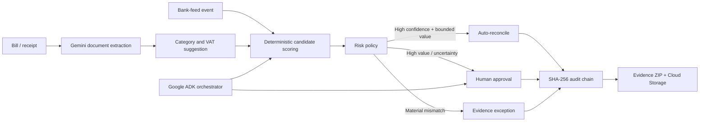

<p align="center">
  
</p>

# Cherry FundOps — Capital Call Control Room

[](https://github.com/sohamtech-uk/cherry-agentic-finops/actions/workflows/ci.yml)

Cherry FundOps turns capital-call notices, LP commitment workbooks and bank cash exports into a
single governed fund-operations case:

**extract → cross-check → reconcile → surface exceptions → route the next action**

The judge-facing product is built for the **Rebuild Private Markets: Ylookup × Encode AI Hackathon**.
It uses **Gemini**, **FastAPI** and deterministic finance controls. The application works locally
with explicitly labelled synthetic cases. Real PDF/image uploads use Gemini when Vertex AI
credentials are available.

## The demonstration

| Scenario | What the judges see | Outcome |
|---|---|---|
| Control break | A notice changes approved bank instructions and booked cash is £500 short | Payment path stays blocked; treasury and investor-ops tasks are created |
| Awaiting cash | The notice and banking record agree but no booked receipt exists | Case remains open for investor operations |
| Clean close | Notice, commitment arithmetic, approved bank record and cash agree | Ready to reconcile |

The distinction matters: **Gemini understands documents, while deterministic controls decide what
can proceed.** Cherry FundOps never initiates a payment.

## Architecture

<p align="center">
  
</p>



Google Cloud services:

- **Cloud Run** — public application and API
- **Vertex AI / Gemini 3.7 Flash** — multimodal document understanding and agent reasoning
- **Firestore** — durable workflow state
- **Pub/Sub** — event-driven workflow notifications
- **Cloud Storage** — versioned audit evidence packs
- **Artifact Registry + Cloud Build** — container delivery

## Run locally

Python 3.11 or later is required.

```bash
git clone git@github.com:sohamtech-uk/cherry-agentic-finops.git
cd cherry-agentic-finops

python3 -m venv .venv
source .venv/bin/activate
python -m pip install -e ".[dev]"
cp .env.example .env

uvicorn app.api:app --reload --port 8080
```

Open <http://localhost:8080>.

Run quality checks:

```bash
ruff check .
ruff format --check .
pytest
node --check app/static/app.js
```

Docker:

```bash
cp .env.example .env
docker compose up --build
```

## Run the Google ADK agent

ADK discovers the application under `agents/cherry_finops`.

```bash
# Vertex AI
export GOOGLE_GENAI_USE_VERTEXAI=true
export GOOGLE_CLOUD_PROJECT=your-project-id
export GOOGLE_CLOUD_LOCATION=global
export CHERRY_GEMINI_MODEL=gemini-3.7-flash

adk web agents
```

Useful prompts:

- `Run the autonomous finance scenario and explain why automation was permitted.`
- `Run the approval scenario. Which deterministic control stopped the workflow?`
- `List the open month-end finance exceptions.`
- `Approve workflow wf_... as Srinivasan after I explicitly confirm.`

The control specialist is instructed never to infer approval. An identified human must explicitly
approve a specific workflow.

## Process a real document

```bash
curl -X POST http://localhost:8080/api/workflows \
  -F 'document=@invoice.pdf;type=application/pdf' \
  -F 'transactions_json=[{"transaction_id":"bank-001","booking_date":"2026-08-22","amount":2450,"currency":"GBP","direction":"debit","description":"OFFICE SOLUTIONS INV-98214","merchant_name":"Office Solutions Co.","reference":"INV-98214"}]'
```

With Google credentials configured, Gemini returns schema-validated finance data. Without Google
credentials, the real-upload endpoint returns a clear `503`; it does not disguise synthetic data as
an actual extraction.

## Evidence and safety controls

Every material transition is appended to a SHA-256 hash chain. The evidence endpoint produces a ZIP
with the extracted document data, ranked candidates, policy decision, complete workflow and audit
trail:

```text
GET /api/workflows/{workflow_id}/evidence
```

Silent automation is blocked by:

- currency mismatch;
- an already-reconciled bank transaction;
- an amount variance above the configured tolerance;
- insufficient reconciliation evidence;
- low document-extraction confidence;
- a transaction above the explicit approval threshold.

The evidence pack is an operational record, not an external audit opinion or tax advice.

## Deploy to the selected Google Cloud account

The target is **`https://finops.cherrymoney.co.uk`**. The simplest first deployment is through the
Cloud Shell of the Google account that owns the project:

```bash
git clone https://github.com/sohamtech-uk/cherry-agentic-finops.git
cd cherry-agentic-finops
bash scripts/deploy-cloudshell.sh YOUR_PROJECT_ID
```

The script enables APIs, creates the runtime identity, Artifact Registry, Firestore, Pub/Sub and the
evidence bucket, builds the container and deploys Cloud Run in `europe-west1`. If domain ownership
has already been verified, it creates the domain mapping and prints the exact DNS records.

**DNS access is required for the final hostname. FTP credentials cannot add or change DNS records.**
See [docs/DEPLOY_GCP.md](docs/DEPLOY_GCP.md).

## Repository map

```text
app/                         FastAPI API, workflow engine and browser UI
agents/cherry_finops/        Google ADK multi-agent application
infra/terraform/             Reproducible Google Cloud infrastructure
scripts/deploy-cloudshell.sh One-command first deployment from Cloud Shell
tests/                       Matching, policy, audit, workflow and API tests
docs/                        Architecture, deployment and demo script
```

## Relationship to Cherry Money

This is a new hackathon service. It does not copy the Cherry Money Laravel monolith or Terraform
repository. Those repositories informed the domain model and integration boundary. The exact source
revisions and reuse disclosure are in [PREEXISTING_CODE.md](PREEXISTING_CODE.md).

## Licence

Apache-2.0. Copyright 2026 Soham London CIC.
