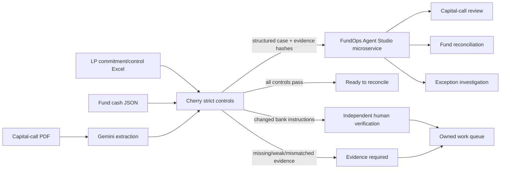
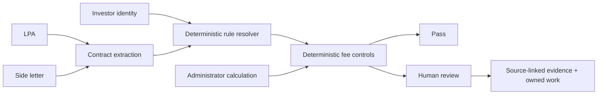

# Cherry FundOps — Capital Call Control Room

[](https://github.com/sohamtech-uk/cherry-agentic-finops/actions/workflows/ci.yml)

Cherry FundOps turns a capital-call notice, LP commitment/control workbook and fund cash evidence
into one governed private-markets case:

**extract → cross-check → reconcile → surface exceptions → route the next action**

The judge-facing experience is prepared for **Rebuild Private Markets: Ylookup × Encode AI
Hackathon**. Gemini interprets the PDF; deterministic Cherry controls decide whether evidence is
strong enough to close, needs more evidence or requires independent human verification.

## DEMO VIDEO URL
https://youtu.be/Gyk8k4IRZW4

## Documentation

- [Local setup guide](docs/LOCAL_SETUP.md) — clone, configure, run, test and troubleshoot Cherry FundOps locally.
- [Website, system architecture & workflow guide](docs/WEBSITE_SYSTEM_AND_WORKFLOW.md) — website map, system diagram, Fund Manager workflow and demo flow.

## Judge-facing input contract

The integrated workflow accepts the three requested source types:

```text
PDF capital-call notice
+ Excel commitment/control workbook
+ JSON fund cash/bank export
                  ↓
POST /api/private-markets/analyse-integrated
```

The response contains:

- Gemini schema-validated extraction;
- strict Cherry commitment/bank/cash controls;
- owned exception work items;
- SHA-256 hashes for all three inputs and the analysis;
- optional FundOps Agent Studio enrichment.

## Architecture



**Control boundary:** Agent Studio enriches the case but does not grant financial authority. Cherry's
deterministic controls remain authoritative, and neither service initiates a payment.

## Contract Agent for NAV quality control

The contract specialist turns LPA and side-letter evidence into cited, effective-dated investor
rules that deterministic NAV checks can consume. Its constrained tool surface is:

```text
search_lpa()
search_side_letter()
extract_clause()
get_effective_date()
get_investor_rule()
```

The service preserves document SHA-256 hashes, section references and PDF page numbers. It applies
investor-specific side-letter terms ahead of the LPA only when the term is active and unambiguous.
Missing dates, conflicting clauses and terms that cannot be structured are returned as
`review_required`; they are never guessed.

The judge-facing Contract Agent demo is a context-derived extension grounded in Ylookup Call 1.
The sponsor pack did not contain an LPA or side letter, so the checked-in documents, parties and
figures are prominently labelled synthetic and kept outside sponsor-native metrics.

```text
Cedar Pension Trust commitment                GBP 20,000,000
Quarterly management fee @ 0.50%                 GBP 100,000
Base investment contribution                   GBP 1,000,000
Side-letter expected total                     GBP 1,000,000
Administrator total                            GBP 1,100,000
Potential overcall                               GBP 100,000
```

Orchard Institutional LP has no side-letter override and passes at GBP 1,100,000 under the LPA
default. This proves that the Cedar exception is not applied across the investor population.

Run the synthetic, cited demonstration:

```text
POST /api/contracts/demo/side-letter-fee
```



The NAV Quality Controller can consume rules resolved from uploaded contract evidence by setting
`use_contract_documents=true` on `POST /api/nav-quality/review`. It refuses to auto-apply a rule
without an exact investor match, explicit override language, an effective date, and a complete
document/page/section/hash locator.

Production-style contract endpoints are protected by the same `X-Cherry-Demo-Token` policy as
private-markets uploads:

```text
POST /api/contracts/documents
POST /api/contracts/search/lpa
POST /api/contracts/search/side-letter
GET  /api/contracts/documents/{document_id}/clauses/{section_reference}
GET  /api/contracts/documents/{document_id}/effective-date
POST /api/contracts/investor-rules/resolve
POST /api/contracts/nav-checks/investor-capital
```

Parsed contract evidence is held in ephemeral memory for the hackathon deployment and is removed by
`POST /api/session/clear-memory`. Raw upload bytes are not retained.

## FundOps Agent Studio microservice

## Agentic Fund Manager control pipeline

`POST /api/fund-manager/analyse` now runs one bounded, traceable pipeline over a mixed evidence
batch:

```text
upload -> classify -> agent plans controls -> deterministic tools run
       -> unified exception queue -> agent investigates -> human action recommended
```

The planning agent can select only tools in the checked-in control catalogue. It forms statement,
position, trade and cash comparison pairs from explicit filename roles (`prior`/`current`,
`internal`/`external`), or from exactly two compatible sources with reduced confidence. Ambiguous
batches are returned as evidence-gap exceptions; the agent never guesses a comparison side.

Each response includes:

- a content-derived `case_id` and evidence-manifest hash;
- the agent's control plan, rationale, confidence, source roles and missing evidence;
- deterministic control runs and their exact tool names;
- one severity/materiality-ranked exception queue, including data-quality failures;
- an investigation for every exception with the selected tool path and recommended human action;
- lineage from investigation to exception, control run, source ID and source SHA-256.

`clean` is returned only when at least one applicable control executed, every planned control
completed, and no exception was generated. Missing adapters or comparison evidence return
`insufficient_evidence`/`partially_evaluated`, never a silent pass.

Sunil's `fundops-agent-studio` backend is kept as a separate service instead of copying it into this
repository. Configure:

```env
FUNDOPS_STUDIO_API_URL=https://<fundops-agent-studio-service>
FUNDOPS_STUDIO_AUDIENCE=https://<fundops-agent-studio-service>
FUNDOPS_STUDIO_TIMEOUT_SECONDS=25
```

For private Google Cloud Run, `FUNDOPS_STUDIO_AUDIENCE` enables server-to-server IAM ID-token
authentication. A static `FUNDOPS_STUDIO_API_TOKEN` can be used for local/non-GCP environments.

Cherry calls:

```text
GET  /integration/cherry/health
POST /integration/cherry/capital-call
```

on Agent Studio. If the microservice is unavailable, Cherry still completes its strict local control
analysis and marks Agent Studio enrichment as unavailable rather than failing the financial review.

## Demo scenarios

| Scenario | What happens | Outcome |
| --- | --- | --- |
| Control break | Bank instructions change and booked cash is £500 short | Evidence required; treasury and investor-ops tasks are created |
| Awaiting cash | Notice and approved bank record agree but no strongly referenced receipt exists | Case remains open for investor operations |
| Clean close | Notice, commitment arithmetic, approved bank record and strongly referenced cash agree | Ready to reconcile |

Public synthetic demos:

```text
POST /api/private-markets/demo/exception
POST /api/private-markets/demo/awaiting-cash
POST /api/private-markets/demo/clean
```

## Control principles

- blank or unapproved banking metadata never counts as approval;
- a capital call cannot exceed the LP commitment remaining before the call;
- investor-name-only bank matches are weak evidence and cannot auto-reconcile;
- automatic close requires strong call/LP reference evidence in booked cash;
- duplicate transaction IDs are treated as a control break;
- low-confidence document extraction requires review;
- Cherry FundOps never authorises or executes a payment.

## Cherry Money relationship

Cherry Money is a separate, pre-existing accounting/open-banking product. If organiser rules permit
pre-existing infrastructure, FundOps can use Cherry Money as a **read-only financial system of
record** through its authenticated WebMCP bridge.

```env
CHERRY_MONEY_API_URL=https://cherrymoney.co.uk
CHERRY_MONEY_API_TOKEN=...
```

Protected endpoint:

```text
GET /api/private-markets/cherry-money/snapshot
```

The private-markets workflow never writes to Cherry Money.

## Real PDF + Excel + JSON analysis

```text
POST /api/private-markets/analyse-integrated
```

Multipart inputs:

| Field | Required | Description |
| --- | --- | --- |
| `capital_call` | yes | capital-call PDF |
| `commitments` | yes | LP commitment/control `.xlsx` |
| `fund_json` | yes | UTF-8 cash/bank `.json` |
| `as_of_date` | no | `YYYY-MM-DD` control date |

In production, real uploads fail closed until `CHERRY_PRIVATE_MARKETS_UPLOAD_TOKEN` is configured.
Clients send it as `X-Cherry-Demo-Token`. The token is not persisted by the browser UI.

The previous CSV/structured fallback endpoint remains available at
`POST /api/private-markets/analyse` for backwards compatibility.

## JSON cash shapes

The integrated JSON parser accepts either a top-level transaction array or:

```json
{
  "transactions": [
    {
      "transaction_id": "TXN-1",
      "booking_date": "2026-09-05",
      "direction": "credit",
      "amount": 1249500,
      "currency": "GBP",
      "counterparty": "Oakfield Pension Trust",
      "reference": "NCGFIII-CALL-2026-03 / LP-001",
      "status": "BOOKED"
    }
  ]
}
```

Common aliases such as `id`, `date`, `value_date`, `amount_gbp`, `payment_reference` and `narrative`
are normalised before strict validation.

## NAV Quality Controller

A second, independent deterministic reviewer for a fund administrator's NAV pack, targeting the
top problem identified from the sponsor call transcripts: a draft NAV that takes several review
rounds before a manager can trust it.

```text
POST /api/nav-quality/review
```

Multipart inputs:

| Field | Required | Description |
| --- | --- | --- |
| `nav_summary` | yes | administrator's reported NAV summary `.json` (balance sheet, NAV bridge, investor capital) |
| `source_ledger` | no | investor-level GL export `.xlsx`, to independently recompute the balance sheet, NAV and investor capital |
| `side_letter_rules` | no | structured side-letter terms `.json`; incomplete source locators route to review |
| `use_contract_documents` | no | resolve investor terms from documents already ingested through `/api/contracts` |

Every check is plain `Decimal` arithmetic, never an LLM: does the balance sheet foot to equity, does
the NAV bridge (opening + contributions + investment movement + income − expenses − distributions)
foot to the reported closing NAV, does an independent recalculation from the source ledger agree with
the reported NAV, does each investor's capital account agree with the ledger (and any side-letter
term that applies to it)? The response is a recommended action
(`ready_to_submit` / `needs_review` / `return_to_administrator`) plus findings, work items and
SHA-256 evidence hashes for every input — including resolved contract rules when selected — and it
never posts a correcting entry or amends the NAV itself. Production deployments protect this upload
with the same `X-Cherry-Demo-Token` policy as the other private-markets evidence routes.

This ships as a standalone endpoint (see `/api/docs`); it is not yet wired into the shared
auto-detect upload form described above.

### Iteration tracking

The sponsor call named the KPI directly: a draft NAV "takes 3-7 iterations to reach an acceptable
version." That number is a claim about real usage, not something a review engine can assert about
itself — so `app/nav_review_history.py` measures it instead. Every `/review` submission is recorded
as one round for its `(legal_entity, period_end)` case, and the response includes an `iteration`
block (`round_number`, `prior_rounds`).

```text
GET /api/nav-quality/cases/{legal_entity}/{period_end}   -- one case's full round history
GET /api/nav-quality/metrics                             -- rounds-to-close across every case
GET /api/nav-quality/daily-health-check                  -- every case, ranked, with open root causes
```

`daily-health-check` (`app/nav_health_check.py`) is the portfolio-level view: every reviewed
fund/period classified `ready` or `attention_needed`, ranked by open critical root causes then
round count, each carrying the root causes still open as of its latest round. It's built entirely
from recorded rounds — nothing here re-runs a review. Running it daily is a deployment choice (a
scheduler hitting the endpoint); this only answers correctly whenever it's called.

In-memory only, matching `app.contracts.ContractRepository`'s scope: this is demo/session state,
not a system of record.

## Statement Review Agent

A deterministic reviewer for the "prior-period text and dates get mechanically rolled forward"
failure mode from the sponsor call transcripts: catching stale disclosures, unmoved subsequent
events and missing/changed entity references between two periods' financial statements.

```text
POST /api/statement-review/compare
```

Multipart inputs:

| Field | Required | Description |
| --- | --- | --- |
| `current_document` | yes | current-period financial statement (`.pdf`, `.txt` or `.md`) |
| `prior_document` | no | prior-period financial statement, to diff against the current one |
| `section_heading` | no | a section to locate in the current document, e.g. `Subsequent Events` |
| `entity_name` | no | an entity to search for, e.g. a portfolio company name |

Section/entity location and the period/date diff are plain text operations, never an LLM: a
`section_heading`/`entity_name` match is heuristic (a miss means investigate further, not that the
section or entity is absent), a `period_diff` reports exactly which lines changed since the prior
document, and a `date_diff` reports which dates are new, dropped or identical across both periods
— an unchanged date is a candidate for a stale rolled-forward disclosure, left for a human or agent
to interpret. The response never amends a statement, and production deployments protect uploads
with the same `X-Cherry-Demo-Token` policy as the other private-markets evidence routes.

This ships as a standalone endpoint (see `/api/docs`) and as agent tools on
`statement_review_specialist` (`app/statement_tools.py`), sharing the same PDF/TXT/Markdown reader
as `/api/contracts`.

## Run locally

For the complete setup, configuration, Docker, Gemini and troubleshooting instructions, see
[docs/LOCAL_SETUP.md](docs/LOCAL_SETUP.md).

Quick start (Python 3.11+):

```bash
git clone git@github.com:sohamtech-uk/cherry-agentic-finops.git
cd cherry-agentic-finops
python3 -m venv .venv
source .venv/bin/activate
python -m pip install -e ".[dev]"
cp .env.example .env
uvicorn app.api:app --reload --port 8080
```

Useful URLs:

```text
http://localhost:8080
http://localhost:8080/#fund-manager
http://localhost:8080/api/docs
http://localhost:8080/api/private-markets/health
http://localhost:8080/api/private-markets/integration/health
http://localhost:8080/api/nav-quality/health
http://localhost:8080/api/statement-review/health
```

Generate backup fixtures:

```bash
make ylookup-fixtures
```

This creates both CSV and JSON cash fixtures; the integrated workflow uses the JSON version.

## Quality gates

```bash
ruff check .
ruff format --check .
mypy app agents
pytest
python -m compileall -q app agents
node --check app/static/app.js
docker build --tag cherry-agent:test .
```

## Deployment

Cherry's target is `https://finops.cherrymoney.co.uk` on Google Cloud Run. The deployment workflow
accepts the Agent Studio URL/audience as GitHub environment variables and uses the existing Cherry
runtime service account for server-to-server invocation.

Agent Studio should be deployed separately as a **private Cloud Run service** backed by the existing
PostgreSQL/Cloud SQL instance (preferably a dedicated `fundops` database on that instance).

## Repository map

```text
app/private_markets.py                       private-markets schemas and Excel/CSV parsing
app/private_markets_strict.py                fail-closed deterministic controls
app/private_markets_io.py                    JSON cash parser
app/private_markets_router.py                legacy/demo and Cherry Money routes
app/private_markets_integration_router.py    PDF + Excel + JSON orchestration
app/nav_quality.py                           NAV Quality Controller schemas, GL parser and checks
app/nav_quality_router.py                    NAV Quality Controller endpoint
app/nav_exceptions.py                        root-cause grouping of NAV review findings
app/nav_review_history.py                    NAV review iteration/round tracking
app/nav_health_check.py                      daily portfolio-level fund health check
app/contracts.py                             contract evidence, precedence and NAV rule checks
app/contract_tools.py                        constrained contract specialist tools
app/contract_router.py                       contract ingestion, search and NAV APIs
app/nav_reconciliation.py                    quick ad hoc balance-sheet/NAV-bridge checks
app/reconciliation_tools.py                  atomic agent tools (read/sum/compare/bridge)
app/statement_tools.py                       statement-review primitives (section/entity/period/date diff)
app/statement_review_router.py               statement-review endpoint
agents/cherry_finops/agent.py                Google ADK agents (reconciliation_specialist and peers)
app/fundops_studio.py                        Agent Studio microservice client
app/static/                                  judge-facing control-room UI
fixtures/private_markets/                    synthetic backup data
scripts/                                     fixture/deployment helpers
tests/                                       controls, API and integration tests
```

## Reuse disclosure

This repository contains pre-existing Cherry Agent work and pre-event Ylookup preparation. The frozen
pre-hardening state remains at `baseline/pre-hardening-2026-09-05` on commit
`22f4461ee793eb9d9ab83828f9992a76c0be3ef6`. Do not represent pre-existing work as code built after
hackathon kickoff. See `PREEXISTING_CODE.md` for details.

## Licence

Apache-2.0. Copyright 2026 Soham London CIC.
