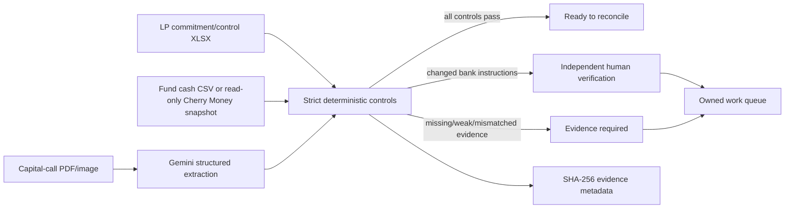

# Cherry FundOps — Capital Call Control Room

[](https://github.com/sohamtech-uk/cherry-agentic-finops/actions/workflows/ci.yml)

Cherry FundOps turns a capital-call notice, LP commitment/control workbook and fund cash evidence
into one governed private-markets case:

**extract → cross-check → reconcile → surface exceptions → route the next action**

The judge-facing experience is prepared for **Rebuild Private Markets: Ylookup × Encode AI
Hackathon**. Gemini interprets documents; deterministic controls decide whether evidence is strong
enough to close, needs more evidence or requires independent human verification.

## Demo scenarios

| Scenario | What happens | Outcome |
| --- | --- | --- |
| Control break | Bank instructions change and booked cash is £500 short | Evidence required; treasury and investor-ops tasks are created |
| Awaiting cash | Notice and approved bank record agree but no strongly referenced receipt exists | Case remains open for investor operations |
| Clean close | Notice, commitment arithmetic, approved bank record and strongly referenced cash agree | Ready to reconcile |

Public synthetic demos are available at:

```text
POST /api/private-markets/demo/exception
POST /api/private-markets/demo/awaiting-cash
POST /api/private-markets/demo/clean
```

## Architecture



### Control principles

- blank or unapproved banking metadata never counts as approval;
- a capital call cannot exceed the LP commitment remaining before the call;
- investor-name-only bank matches are weak evidence and cannot auto-reconcile;
- automatic close requires strong call/LP reference evidence in booked cash;
- duplicate transaction IDs are treated as a control break;
- low-confidence document extraction requires review;
- Cherry FundOps never authorises or executes a payment.

## Cherry Money relationship

Cherry Money is a separate, pre-existing accounting/open-banking product. If the organisers permit
pre-existing infrastructure, FundOps can use Cherry Money as a **read-only financial system of
record** through its authenticated WebMCP bridge.

Configure:

```env
CHERRY_MONEY_API_URL=https://cherrymoney.co.uk
CHERRY_MONEY_API_TOKEN=...
```

Then the protected endpoint:

```text
GET /api/private-markets/cherry-money/snapshot
```

reads the bounded company-scoped `/api/webmcp/bootstrap` projection. The private-markets route does
not write to Cherry Money. See `PREEXISTING_CODE.md` for the exact reuse/baseline disclosure.

## Real three-file analysis

```text
POST /api/private-markets/analyse
```

Multipart inputs:

| Field | Required | Description |
| --- | --- | --- |
| `capital_call` | one of | Capital-call/distribution PDF or image |
| `capital_call_json` | one of | Structured fallback when Gemini is unavailable |
| `commitments` | yes | LP commitment/control `.xlsx` |
| `cash` | yes | UTF-8 fund cash `.csv` |
| `as_of_date` | no | `YYYY-MM-DD` control date |

In production, real uploads fail closed until `CHERRY_PRIVATE_MARKETS_UPLOAD_TOKEN` is configured.
Clients send the same value as `X-Cherry-Demo-Token`. Synthetic demo endpoints remain public.

The response includes SHA-256 hashes of each input plus the deterministic analysis so the review
brief can be tied back to the evidence used for the decision.

## Run locally

Python 3.11+ is required.

```bash
git clone git@github.com:sohamtech-uk/cherry-agentic-finops.git
cd cherry-agentic-finops
python3 -m venv .venv
source .venv/bin/activate
python -m pip install -e ".[dev]"
cp .env.example .env
uvicorn app.api:app --reload --port 8080
```

Open:

```text
http://localhost:8080
http://localhost:8080/api/docs
http://localhost:8080/api/private-markets/health
```

Generate the synthetic backup fixtures:

```bash
make ylookup-fixtures
```

## Quality gates

```bash
ruff check .
ruff format --check .
mypy app agents
pytest
python -m compileall -q app agents
node --check app/static/app.js
docker build --tag cherry-agent:test .
```

CI runs the same lint/type/test/compile/browser/container checks on pull requests.

## Deployment

The existing deployment target is `https://finops.cherrymoney.co.uk` on Google Cloud Run. See
`docs/DEPLOY_GCP.md` for deployment details.

## Repository map

```text
app/private_markets.py          Private-markets schemas, parsers and legacy analysis
app/private_markets_strict.py   Fail-closed deterministic control policy
app/private_markets_router.py   Demo, protected real analysis and read-only Cherry Money endpoint
app/static/                     Judge-facing control-room UI
fixtures/private_markets/       Synthetic backup data
scripts/                        Fixture/deployment helpers
tests/                          Controls, API and workflow tests
docs/                           Readiness/deployment documentation
```

## Reuse disclosure

The repository contains pre-existing Cherry Agent work and pre-event Ylookup preparation. The frozen
pre-hardening state is preserved at `baseline/pre-hardening-2026-09-05` on commit
`22f4461ee793eb9d9ab83828f9992a76c0be3ef6`. Do not represent that pre-existing work as code built
after hackathon kickoff. See `PREEXISTING_CODE.md` for details.

## Licence

Apache-2.0. Copyright 2026 Soham London CIC.
