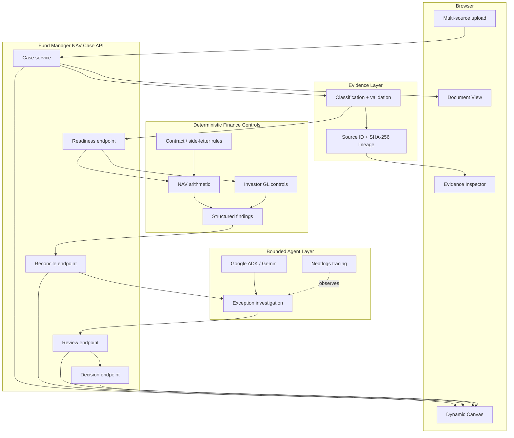

# Cherry CFO — Syndicate architecture

## Design principle

**Use AI for understanding, planning and investigation; use deterministic software for financial authority; keep final judgement human.**

For the Syndicate Track 2 submission, the judge-facing workflow is the **NAV Quality Controller**. The system is designed to help a fund controller turn a fragmented close pack into an evidence-led review without allowing a model to invent authoritative NAV figures or silently change accounting state.

## End-to-end flow

```text
mixed NAV evidence
      ↓
classify + validate
      ↓
evidence inventory + lineage
      ↓
readiness: which controls are supported?
      ↓
deterministic NAV / GL controls
      ↓
structured findings + exceptions
      ↓
agentic investigation / remediation summary
      ↓
human NAV decision
      ↓
audit-ready case + document view
```

## Components

### 1. Dynamic NAV workbench

The browser UI is served from `app/static/` and presents two views of the same case:

- **Canvas** — uploaded evidence and generated finance objects appear as connected, draggable cards.
- **Document** — the case becomes a controller-style review with evidence, controls, findings and decision.

The browser never decides financial truth. It sends evidence and actions to the API and renders returned state.

### 2. Evidence intake and classification

`app/fund_manager_classification.py` classifies mixed evidence using structure where possible instead of trusting filenames alone.

The inventory preserves source metadata such as:

- source ID;
- filename;
- detected evidence type;
- validation state;
- warnings / validation errors; and
- SHA-256 identity.

Unrecognised or invalid evidence remains visible for review instead of being guessed into a supported type.

### 3. NAV readiness

`app/fund_manager_nav_controller.py` asks a deliberately narrow question before reconciliation:

> **What can be checked from the evidence actually present?**

Readiness identifies supported inputs such as an administrator NAV summary, investor-level GL and structured side-letter rules, then enables only the controls that can be grounded in those inputs.

Missing optional evidence skips dependent checks or becomes an explicit gap. It is never fabricated.

### 4. Deterministic NAV controls

`app/nav_quality.py` and related control modules own authoritative arithmetic and reconciliation logic.

Examples include:

- balance-sheet footing;
- NAV bridge footing;
- independent NAV recalculation where supported;
- investor-level GL source validation;
- balance-sheet / source-ledger comparisons;
- investor-capital reconciliation; and
- cited side-letter rule checks where supported.

Money calculations use deterministic code. The model cannot turn a failed control into a pass.

### 5. Agentic exception review

After deterministic controls run, the bounded agent layer can:

- explain findings;
- group related exceptions;
- identify evidence gaps;
- summarise root causes;
- prepare a remediation package; and
- recommend a supported next action.

The agent operates on server-provided facts. It does not own the NAV calculation or final financial decision.

### 6. Human decision gate

A person records the final case decision. Current NAV routes include:

- `approve_nav`
- `approve_with_exception`
- `request_evidence`
- `return_to_administrator`
- `escalate`

This is a workflow state, not an error fallback.

### 7. Evidence lineage and auditability

The workbench surfaces source IDs and SHA-256 evidence identity so a reviewer can trace a finding back to the source evidence used by the control.

Specialist workflows elsewhere in the repository also maintain hash-linked audit state. The Syndicate product principle is the same: **a result should be inspectable, attributable and reproducible.**

### 8. Agent orchestration and observability

- **AO (Agent Orchestrator)** was used to coordinate focused engineering sessions during the hackathon. Session evidence is recorded in `SYNDICATE_BUILD_LOG.md`.
- **Codex** was used as an engineering/orchestration agent during implementation.
- **Google ADK / Gemini** provides bounded model-backed planning or investigation where configured.
- **Neatlogs** instrumentation is available for tracing agent workflows when `NEATLOGS_API_KEY` is configured.

The deterministic NAV workflow remains the financial authority even when model access or observability is unavailable.

## System diagram



## API contract

```text
POST /api/fund-manager/cases
POST /api/fund-manager/cases/{case_id}/evidence
GET  /api/fund-manager/cases/{case_id}
POST /api/fund-manager/cases/{case_id}/nav/readiness
POST /api/fund-manager/cases/{case_id}/nav/reconcile
POST /api/fund-manager/cases/{case_id}/nav/review
POST /api/fund-manager/cases/{case_id}/nav/decision
```

## Public deployment

The Syndicate workbench is deployed at:

```text
https://cherry-cfo-canvas.vercel.app
```

The hosted demo includes browser-side transport optimisation for large Excel evidence so the UI can work within serverless request-size limits. That optimisation is a transport concern, not a financial control: the NAV controller still validates the structured workbook presented to the backend.

## Financial boundary

The submission deliberately does **not** expose unrestricted financial autonomy.

- No model-generated number becomes an authoritative NAV merely because the model is confident.
- Missing evidence cannot be silently substituted.
- The agent cannot override deterministic control state.
- The workbench does not initiate payments.
- The workbench does not silently amend an official NAV or production ledger.
- Human reviewers retain the final sign-off decision.

This is the architecture behind the Syndicate message:

> **Cherry CFO does the repetitive finance work required to reach a decision; humans remain responsible for the decisions that matter.**
