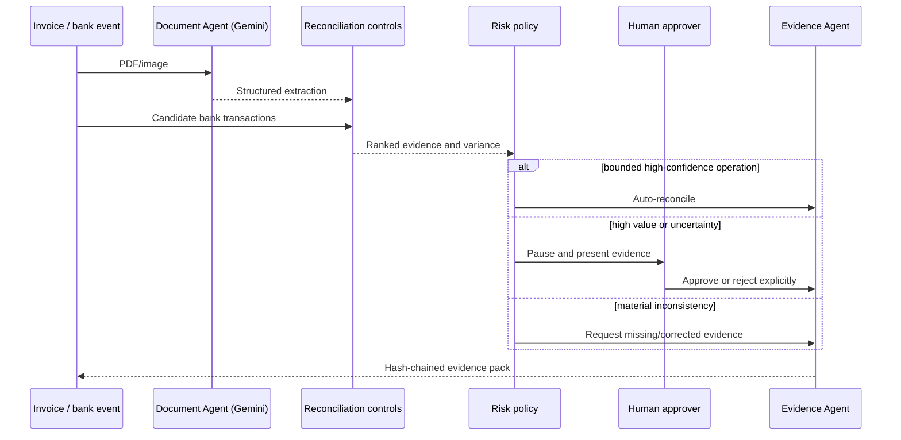

# Cherry Agent architecture

## Design principle

**Use AI for understanding and planning; use deterministic software for financial authority.**

A model can extract an invoice, explain a likely match and coordinate tools. It cannot waive a
currency mismatch, reuse a reconciled transaction, override a material amount variance or invent a
human approval.

## Components

### 1. Document Agent

Gemini 3.7 Flash receives PDF/image bytes and returns a schema-constrained `DocumentExtraction`.
Pydantic validates required fields, money values, currency and confidence. The prompt explicitly
forbids invented financial data.

### 2. Categorisation Agent

The extraction includes a conservative category and VAT-treatment suggestion. These are visibly
labelled suggestions rather than tax advice. A future Cherry Money integration can map them to each
organisation's chart of accounts.

### 3. Reconciliation Agent

Candidate scoring is deterministic and explainable:

| Evidence | Maximum score |
|---|---:|
| Amount | 45 |
| Date proximity | 20 |
| Invoice/payment reference | 20 |
| Supplier/merchant similarity | 10 |
| Currency | 5 |

Each candidate exposes its score, amount variance and factor-level explanation.

### 4. Risk & Approval Agent

The policy chooses exactly one bounded action:

- `auto_reconcile`
- `require_approval`
- `request_evidence`

The policy blocks automation for duplicate use, currency mismatch, material amount variance, weak
evidence, low extraction confidence or high transaction value. Human approval records both the
identity and note before the state machine resumes.

### 5. Evidence Agent

Each material transition contains the previous event hash. The current event hash is computed from a
canonical JSON representation, producing a tamper-evident SHA-256 chain. The evidence ZIP contains a
manifest with individual file digests.

## Runtime flow

## Google Cloud

- Cloud Run executes a stateless container.
- Firestore holds durable workflows and audit events.
- Pub/Sub publishes workflow-state events for future asynchronous workers.
- Cloud Storage stores versioned evidence ZIPs.
- Cloud Run's service account receives only Vertex AI user, Datastore user, object admin on evidence
  storage, Pub/Sub publisher and logging permissions.
- No JSON service-account key is required; Cloud Run uses Application Default Credentials.
