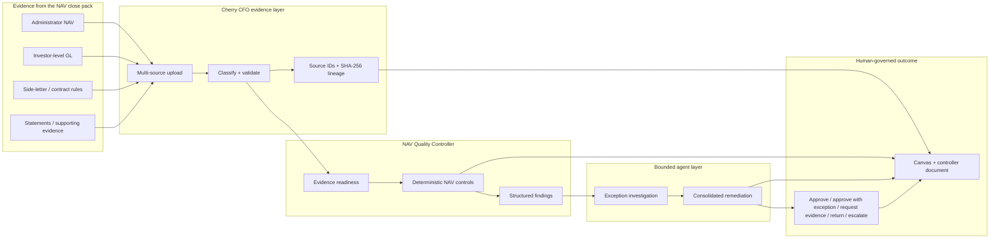

# Cherry CFO — Syndicate architecture diagram

This is the judge-facing architecture for **Syndicate by Maximor, Track 2 — Autonomous Office of the CFO**.

The final workflow is the **NAV Quality Controller**: evidence comes in, Cherry determines what can be checked, deterministic controls produce financial findings, an agent helps investigate exceptions, and a human owns the final decision.



## Authority boundary

```text
AI understands / coordinates
          ↓
deterministic controls calculate / validate
          ↓
AI investigates exceptions
          ↓
human decides
```

- The model does not manufacture authoritative NAV figures.
- Missing evidence is surfaced as a gap rather than guessed.
- Deterministic control results cannot be overwritten by the agent.
- Human judgement is explicit and attributable.
- No payment is initiated and no official NAV / production ledger is silently amended.

## User experience

The same case has two representations:

- **Canvas** — visual evidence/control graph with draggable components and provenance inspection.
- **Document** — controller-style review summary for sign-off and audit discussion.

Live Syndicate workbench: https://cherry-cfo-canvas.vercel.app

For implementation detail, see [ARCHITECTURE.md](ARCHITECTURE.md) and [WEBSITE_SYSTEM_AND_WORKFLOW.md](WEBSITE_SYSTEM_AND_WORKFLOW.md).
