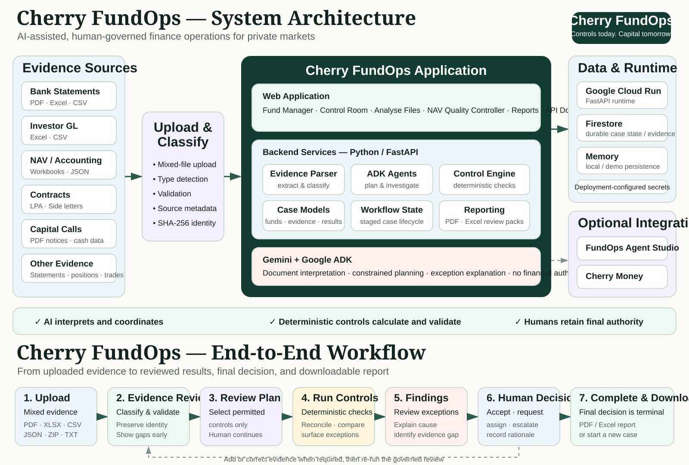

# Cherry FundOps — Architecture Diagram

This rendered diagram is the visual companion to [Website, System Architecture & Demo Workflow](WEBSITE_SYSTEM_AND_WORKFLOW.md).

It shows the current Cherry FundOps architecture and the end-to-end Fund Manager journey in one judge-friendly view: evidence sources → upload/classification → FastAPI application → Gemini/Google ADK orchestration → deterministic controls → persistence/integrations → human decision → downloadable review output.

## Control boundary

- **AI interprets and coordinates.**
- **Deterministic controls calculate and validate.**
- **Humans retain final authority.**
- Cherry FundOps does not initiate payments or silently amend an official NAV or ledger.

The SVG is stored as an editable repository asset at `docs/assets/cherry-fundops-system-architecture-and-workflow.svg` so it renders directly in GitHub documentation without depending on an external image host.
