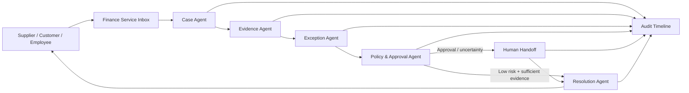

# Cherry Finance Service Agent

## Great Agent Hackathon — Stage 1 Design Document

**Track:** AI-native Enterprise  
**Stage:** Stage 1 concept / prototype design  
**Team size:** 2  
**Project status:** New hackathon-specific concept. This document does not submit any pre-existing code as a new build.

## One-line pitch

Cherry Finance Service Agent is an autonomous finance service desk that investigates supplier, customer and employee payment enquiries, resolves low-risk cases, routes exceptions and approvals to the right human, and preserves an auditable evidence trail.

## Problem

Finance teams repeatedly handle questions such as:

- Has invoice INV-1042 been paid?
- Why is this payment delayed?
- Who needs to approve this invoice?
- Can you resend the invoice or payment reference?
- Why does the bank amount not match the invoice?
- Which overdue customer invoices need follow-up?

Answering these questions often requires manual work across inboxes, invoices, accounting systems, bank feeds, approval records and payment systems. Traditional chatbots can answer FAQs, but they usually cannot investigate a live finance case, gather evidence, apply financial controls, coordinate the next action and explain what happened.

## Proposed solution

Cherry Finance Service Agent takes ownership of a finance enquiry from question to resolution.

The target workflow is:

**Enquiry → identify finance object → gather evidence → evaluate status → resolve or escalate → communicate → audit trail**

The agentic system is split into specialist responsibilities:

1. **Case Agent** — understands the incoming enquiry and identifies the supplier, customer, invoice, payment or transaction involved.
2. **Evidence Agent** — gathers invoice data, transaction data, approval state and supporting records.
3. **Exception Agent** — detects missing evidence, amount mismatches, duplicate references and other inconsistencies.
4. **Policy & Approval Agent** — checks deterministic financial rules and routes cases to a named human when authority is required.
5. **Resolution Agent** — communicates an evidence-backed outcome or next action.
6. **Collections Agent** — coordinates controlled follow-up for overdue receivables.
7. **Human Handoff** — transfers the case when confidence, policy or financial authority requires human judgement.

## Design principle

**AI interprets context; deterministic financial controls decide what the AI is authorised to do.**

The agent must never invent an approval, fabricate evidence or silently execute a high-risk financial action. Every important decision should be explainable from the evidence and policy state available to the system.

## Stage 1 prototype scenario

### Scenario: overdue supplier invoice

A supplier asks:

> “Hi, we’re Office Solutions. Invoice INV-98214 for £12,500 is overdue. Can you tell me when we’ll be paid?”

The prototype demonstrates this sequence:

1. Cherry identifies supplier **Office Solutions** and invoice **INV-98214**.
2. Invoice amount is verified as **£12,500**.
3. Cherry checks available payment/bank evidence and finds no completed payment.
4. Approval status shows that the invoice is awaiting approval.
5. The policy layer detects that the amount exceeds the autonomous authority threshold.
6. Automatic resolution is blocked.
7. The case is routed to the appropriate human approver with the relevant evidence.
8. The supplier receives an evidence-backed status update rather than a guessed answer.
9. The full case history is retained for auditability.

### Contrast scenario: payment already completed

A second supplier asks whether **INV-98215** has been paid.

Cherry finds a matching bank transaction with sufficient evidence and returns the verified payment status and reference without unnecessary human intervention.

The contrast demonstrates the core behaviour: **autonomy where safe, human control where required.**

## Prototype screens

### 1. Finance Inbox
Shows incoming supplier, customer and employee finance enquiries and their status.

### 2. Agent Investigation
Shows the finance object identified by the agent and the evidence being gathered: invoice, transaction, approval state and related records.

### 3. Decision & Controls
Shows match confidence, detected exceptions, policy checks and whether the system can resolve autonomously.

### 4. Human Handoff
Shows the approver, the reason approval is required and the evidence package needed to make the decision.

### 5. Resolution Timeline
Shows the final response sent to the requester plus an ordered audit trail of agent and human actions.

## High-level architecture

## Safety and governance

The Stage 2 implementation should include explicit controls such as:

- no inferred human approval;
- authority thresholds for financial actions;
- deterministic checks for amount and currency mismatches;
- evidence sufficiency checks before autonomous resolution;
- clear confidence and exception states;
- a complete action timeline;
- human escalation for ambiguous or high-value cases;
- explicit separation between communication, recommendation, approval and payment execution.

## Why it is agentic

Cherry is not simply a chatbot over accounting data. The system is designed to:

- interpret an unstructured request;
- form a case;
- select and gather evidence;
- coordinate specialist agents;
- apply deterministic controls;
- decide whether to continue autonomously or hand off;
- communicate the result; and
- preserve a trace of how the case was handled.

The user gives Cherry the finance problem, not a sequence of software commands.

## Expected impact

For small and medium-sized finance teams, the intended benefits are:

- faster supplier and customer responses;
- reduced repetitive finance administration;
- fewer missed exceptions;
- safer use of AI in financial workflows;
- clearer human accountability; and
- a reusable service layer across accounting, banking and payment systems.

## Team fit

The team is building Cherry Money / Cherry Pay and has practical experience with finance workflows, cloud/platform engineering, testing, payments and accounting integrations. This gives the team the domain context needed to design an agent that is useful in real finance operations rather than a generic AI assistant.

## Relationship to earlier Cherry work

The team has previously explored governed finance automation, reconciliation, approval controls and audit evidence in the broader Cherry ecosystem. Those learnings are prior experience only.

**For the Great Agent Hackathon, the Cherry Finance Service Agent concept, Stage 1 design material and any Stage 2 competition implementation are treated as a distinct hackathon entry. Pre-existing application code is not presented as newly created hackathon code.**

## Stage 2 build plan

If shortlisted, the 24-hour build would focus on one polished end-to-end supplier-payment enquiry journey rather than attempting a full accounting suite.

Priority sequence:

1. finance inbox and case creation;
2. invoice/payment evidence model;
3. specialist agent orchestration;
4. deterministic policy and approval controls;
5. human handoff;
6. supplier response generation;
7. audit timeline;
8. one autonomous case and one approval-required case for the final demonstration.

## Demo message

> **Give the finance problem to Cherry. It investigates the evidence, resolves what it safely can, and brings a human in exactly when financial judgement or authority is required.**
