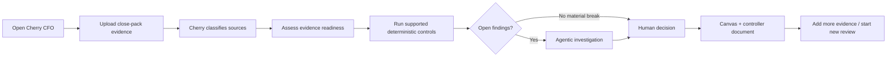
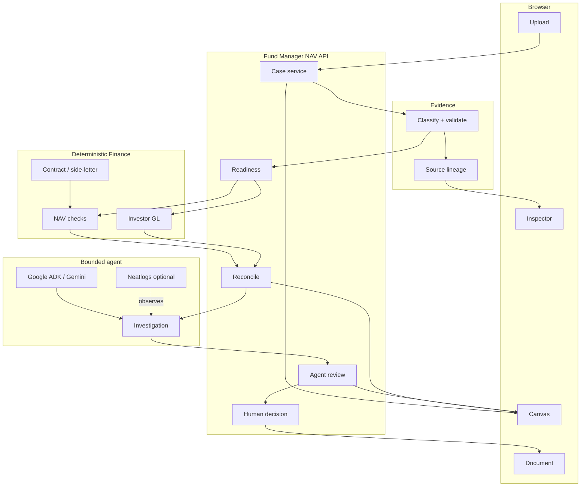

# Cherry CFO — Website, System & NAV Controller Workflow

This document describes the **Syndicate by Maximor Track 2** judge-facing experience on branch `ui/syndicate-cfo-canvas`.

**Live workbench:** https://cherry-cfo-canvas.vercel.app

## 1. Product summary

Cherry CFO is a human-governed autonomous-finance workspace. The final Syndicate workflow focuses on **NAV quality control for fund controllers**.

The product accepts fragmented close evidence, determines which checks are supportable, runs deterministic financial controls, consolidates exceptions with a bounded agent, and routes the outcome to a human decision.

The governing principle is:

> **AI interprets and coordinates. Deterministic controls calculate and validate. Humans retain final authority.**

Cherry CFO does not initiate payments or silently amend an official NAV or production ledger.

## 2. Current website structure

The Syndicate branch is intentionally task-focused.

| Area | Purpose |
| --- | --- |
| **Canvas** | Visual evidence/control map for the active NAV review |
| **Document** | Controller-style review generated from the same case state |
| **Upload evidence** | Multi-file, multi-batch NAV close-pack intake |
| **Evidence readiness** | Shows which controls can run from supplied evidence |
| **Deterministic controls** | Runs the supported NAV / GL finance checks |
| **Agent review** | Consolidates deterministic findings and remediation context |
| **Record decision** | Explicit human NAV sign-off / evidence / escalation route |
| **Evidence inspector** | Source classification, lineage and raw returned state |

The UI is not a collection of separate specialist-agent products. Specialist capabilities remain behind one controller workflow.

## 3. User journey



The user is shown the progression as case state. The system must not show a financial control as complete before the backend returns that result.

## 4. Initial canvas

A new review opens with a simple controller instruction:

> **Drop the close pack. Watch the control map build itself.**

The primary action is **Upload NAV documents**. The initial hero is kept clear of the chat composer and asset dock so upload remains visible on normal laptop viewports.

Users can also drag files onto the canvas.

## 5. Multi-source evidence upload

The upload dialog supports:

- selecting several files at once;
- adding more files in later picker batches;
- adding a folder;
- removing individual selected files;
- mixing evidence types in one review; and
- adding further evidence to an existing case.

Supported browser file extensions include:

```text
PDF · XLSX · XLS · CSV · JSON · TXT · MD · ZIP
```

Typical fund-controller evidence includes:

- administrator NAV data;
- investor-level GL exports;
- statements;
- side-letter / contract rules;
- bank/custodian evidence;
- loader/reference workbooks; and
- other supporting documents.

### Hosted large-file transport

The public Vercel demo has request-size constraints. Large Excel sources can therefore be compacted in the browser before transport and sent in smaller requests.

For the recognised `Investor-Level GL` layout, the transport optimiser preserves the fields used by the NAV controller and can aggregate rows while preserving relevant period-end balances when required to fit the hosted request boundary.

This is a transport optimisation only. Classification and deterministic controls still validate the structured file presented to the backend.

## 6. Evidence classification

After upload, Cherry builds a case-level inventory.

Each source can expose:

- filename;
- source ID;
- detected type;
- validation status;
- warnings/errors; and
- SHA-256 identity.

The classifier prefers workbook/document structure over filename-only assumptions.

Unknown or invalid files stay visible as review evidence and are excluded from control planning rather than silently treated as valid financial inputs.

## 7. Evidence readiness

Readiness answers:

> **Which NAV controls can run from what we actually have?**

The current controller can recognise supported inputs such as:

- administrator NAV summary;
- investor-level GL; and
- structured side-letter rules.

Examples:

| Evidence available | Behaviour |
| --- | --- |
| Administrator NAV summary | Enables summary-based footing / NAV checks |
| Investor-level GL | Enables source-ledger validation / partial NAV review |
| Summary + GL | Enables richer summary-versus-ledger reconciliation |
| Side-letter rules + relevant NAV evidence | Enables supported investor-rule checks |
| Raw NAV workbook without normalised adapter | Recognised evidence may remain a gap / adapter limitation rather than a guessed summary |
| No supported NAV input | Readiness remains `needs_input` |

Missing optional evidence does not automatically block every other supported check.

## 8. Deterministic controls

When readiness is sufficient, the user can run **NAV controls**.

The server-side financial layer owns the arithmetic and comparisons. Depending on evidence, the result may include:

- balance-sheet footing;
- NAV bridge footing;
- independent NAV recalculation;
- investor-GL source validation;
- source-ledger comparisons;
- investor-capital checks; and
- contract-rule validations.

The output includes structured findings rather than relying on an LLM-generated pass/fail statement.

## 9. Agentic review

After deterministic reconciliation, the agentic review can consolidate the open finance work.

It may organise:

- deterministic findings;
- root causes;
- evidence gaps;
- administrator remediation items; and
- a recommended next action.

The agent is advisory. Its output does not change the NAV calculation or deterministic control state.

Where configured, Google ADK / Gemini provides the bounded model layer. Neatlogs can observe the run without owning workflow state.

## 10. Human decision

Once the review is ready for judgement, the user can record one of the explicit NAV actions:

```text
Approve NAV
Approve with exception
Request evidence
Return to administrator
Escalate
```

The controller remains the decision owner.

This is the core Track 2 product behaviour: the agent should reduce investigation effort without hiding or bypassing the human judgement that matters.

## 11. Dynamic canvas

Evidence and generated workflow state are represented as draggable nodes.

Typical layout:

```text
Evidence documents
       │
       ├──────────────┐
       ▼              ▼
Evidence readiness   source lineage
       │
       ▼
Deterministic NAV controls
       │
       ├── findings / exceptions
       ▼
Agentic review
       │
       ▼
Human decision
```

Selecting a node opens an inspector with details, evidence lineage and raw state. Relationship lines make dependencies visible.

The asset dock provides quick access to uploaded sources and generated workflow objects after a case exists.

## 12. Document view

The **Document** toggle renders the same case into a controller-oriented review.

Current sections include:

- Executive summary
- Evidence pack
- NAV controls
- Open items
- Human decision

It is a review artefact, not a posting instruction.

## 13. Judge-facing API

```text
POST /api/fund-manager/cases
POST /api/fund-manager/cases/{case_id}/evidence
GET  /api/fund-manager/cases/{case_id}
POST /api/fund-manager/cases/{case_id}/nav/readiness
POST /api/fund-manager/cases/{case_id}/nav/reconcile
POST /api/fund-manager/cases/{case_id}/nav/review
POST /api/fund-manager/cases/{case_id}/nav/decision
```

The public Vercel deployment exposes the same UI contract through its hackathon NAV bridge/runtime.

## 14. System architecture



## 15. Financial authority boundary

The following rules are product requirements, not just demo copy:

- the browser never calculates the authoritative finance result;
- missing evidence must remain missing;
- agent confidence cannot override deterministic checks;
- exceptions remain explicit until resolved by supported workflow state;
- the human owns final sign-off;
- the Syndicate workbench does not initiate a payment; and
- the Syndicate workbench does not silently amend an official NAV or production ledger.

## 16. Relationship to older repository modules

The repository contains reusable / pre-existing private-markets code and tests, including modules with `ylookup_*` names. Those names are retained for compatibility and provenance.

For the **current branch and submission**, the product story is:

> **Cherry CFO — Autonomous NAV Quality Controller for Syndicate Track 2.**

Use `SYNDICATE_BUILD_LOG.md` and `PREEXISTING_CODE.md` to understand which work predates the official hackathon start.
