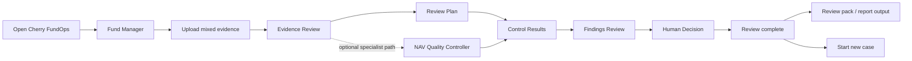
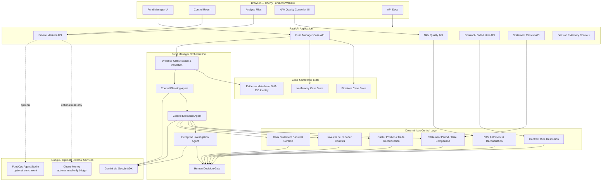
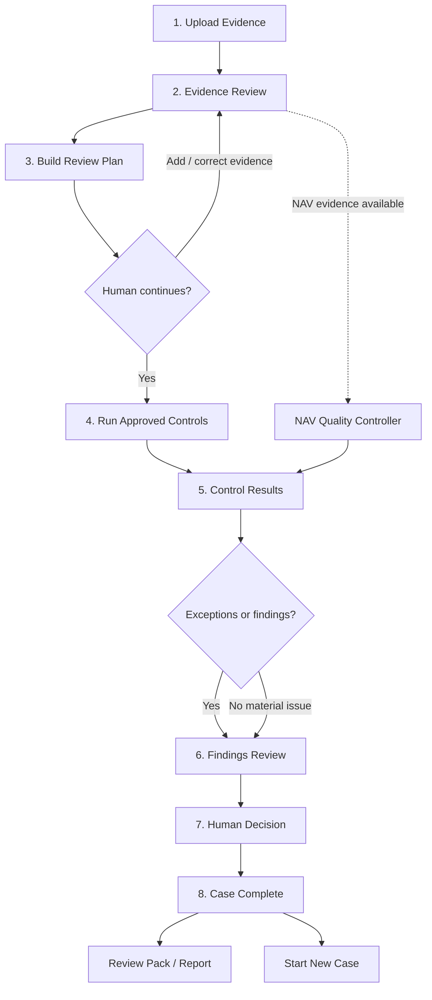
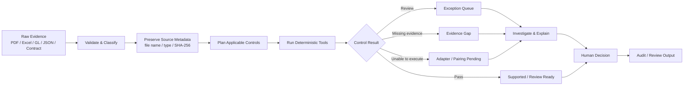
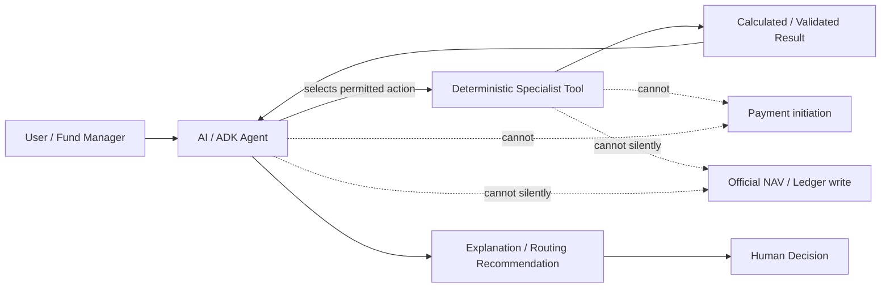
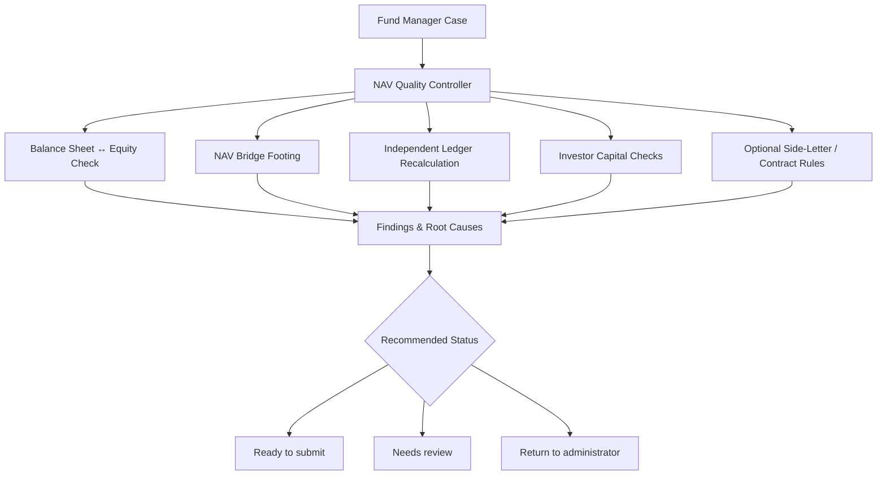
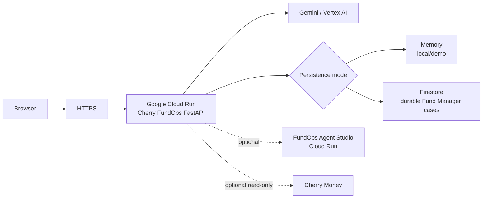
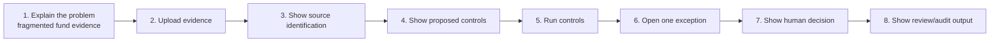

# Cherry FundOps — Website, System Architecture & Demo Workflow

This document explains the Cherry FundOps website, the system components behind it, and the end-to-end Fund Manager workflow used for the demo.

Current Cloud Run demo entry point:

```text
https://cherry-finops-248441114592.europe-west1.run.app/#fund-manager
```

The Cloud Run hostname can change between deployments, so the repository and configured public base URL remain the source of truth.

---

## 1. Product summary

Cherry FundOps is a private-markets finance-operations control layer.

It accepts fragmented evidence such as PDFs, Excel workbooks, investor-level GL data, bank/cash data, NAV packs, LPAs, side letters, statements, positions, and trades. Cherry identifies the evidence, plans the relevant review, runs deterministic controls, surfaces exceptions, and routes the outcome to a human decision.

The core control principle is:

> **AI interprets and coordinates. Deterministic controls calculate and validate. Humans retain final authority.**

Cherry FundOps does **not** initiate payments, silently post journals, or silently amend an official NAV.

---

## 2. Website structure

The browser UI is served by the same FastAPI application as the API.

The primary experience contains these product areas:

| Area | Purpose |
| --- | --- |
| **Fund Manager** | Staged review of mixed fund evidence from upload through final human decision |
| **Control room** | Judge-facing capital-call control example and exception view |
| **Workflow** | Explains the product's evidence-to-control operating model |
| **Analyse files** | Auto-routed private-markets evidence analysis |
| **API** | FastAPI/OpenAPI documentation for the available endpoints |
| **NAV Quality Controller** | Independent NAV quality/reconciliation review available from the Fund Manager case experience |

The Fund Manager is the clearest demonstration of the platform architecture because it shows explicit stages instead of treating the whole process as one opaque AI call.

---

## 3. Website user journey



The user is always shown what stage the case is in. Earlier stages explain what Cherry understood and what controls it proposes before any governed execution occurs.

---

## 4. High-level system architecture



### Architecture interpretation

- **The browser is not the control authority.** It submits evidence and displays case state.
- **FastAPI owns the case workflow and API boundary.**
- **Google ADK/Gemini is used for bounded planning, interpretation, and investigation.**
- **Deterministic tools remain authoritative for calculations, mappings, reconciliations, and rule checks.**
- **The final decision remains human.**
- **Persistence is configurable:** memory is the default local setup; Firestore is available for durable Cloud Run Fund Manager cases.

---

## 5. Fund Manager staged workflow

The Fund Manager intentionally separates understanding, planning, execution, investigation, and decision.



### Stage 1 — Upload evidence

The user can provide mixed evidence rather than forcing every file into one schema.

Typical types include:

- PDF
- XLSX / XLS
- CSV
- JSON
- TXT / Markdown where supported
- ZIP containing evidence files

The browser sends the evidence to the Fund Manager case endpoint once. Later stages operate on the stored case rather than repeatedly uploading the same source bytes.

### Stage 2 — Evidence Review

Cherry classifies and validates the uploaded sources.

Examples:

- bank statement
- bank-statement working workbook
- investor-level GL
- loader/mapping workbook
- NAV workbook
- LPA
- side letter
- financial statement
- positions
- trades
- cash/bank transactions

This stage answers **“What evidence did the user give us?”** It does not claim a financial pass/fail.

### Stage 3 — Review Plan

The Fund Manager planning agent receives the server-side classification report and the checked-in control catalogue.

It can plan only registered controls and classifies them as:

- ready
- awaiting evidence
- adapter pending

The planner does **not** execute a reconciliation or create a financial result.

### Stage 4 — Control execution

Only controls that reached a ready state and were advanced by the user are executed.

Examples of deterministic specialist controls include:

- bank-statement workbook reconciliation
- investor GL review
- loader-sample review
- bank statement versus cash comparison
- position reconciliation
- trade reconciliation
- cash reconciliation
- financial-statement period/date comparison

The agent coordinates which approved tool to invoke; the tool output is the authoritative calculation/result.

### Stage 5 — Control Results

The UI displays:

- controls run
- completion status
- issues found
- material/critical counts where available
- recommended next action
- evidence or data gaps

A missing adapter or missing comparison source is not converted into a silent pass.

### Stage 6 — Findings Review

The exception-investigation agent reviews the deterministic results and issues. It may explain:

- likely cause
- evidence gap
- priority
- related exception context
- recommended human action

It is not permitted to overwrite the deterministic result.

### Stage 7 — Human Decision

The user records the explicit outcome. Current decision routes include concepts such as:

- accept and close
- request evidence
- assign for review / monitor
- escalate

This is the final authority boundary.

### Stage 8 — Completion and report

A completed case should present the final decision as a terminal state and provide review-ready output such as PDF/Excel reports or other evidence packs where enabled by the deployed version.

The report is an audit/review artefact, not an instruction to move money or change an official accounting record.

---

## 6. Evidence-to-control workflow

This diagram focuses on what happens to the evidence itself rather than the UI stages.



---

## 7. Agent and control boundary



### Responsibility split

| Component | Responsible for | Not responsible for |
| --- | --- | --- |
| AI / ADK | interpretation, planning, tool selection, exception explanation | authoritative arithmetic, payment approval, silent financial writes |
| Deterministic controls | calculations, reconciliations, mappings, validation rules | business approval outside encoded policy |
| Human reviewer | final decision, accepting/rejecting evidence, escalation | recomputing all controls manually |

---

## 8. Specialist areas

### Statement Agent

Business-facing actions:

- Read document
- Compare periods
- Find section
- Find entity
- Compare dates

### Reconciliation Manager

Business-facing actions:

- Read workbook
- Calculate totals
- Compare values
- Build reconciliation bridge
- Query records

### Contract Manager

Business-facing actions:

- Search fund agreement
- Search side letter
- Extract clause
- Check effective date
- Resolve investor rule

### Exception Manager

Business-facing actions:

- View exceptions
- Group related issues
- Check materiality
- Trace dependencies
- Route next-best work

These labels are deliberately written as normal user actions even though the backend may map them to constrained tool functions.

---

## 9. NAV Quality Controller path

The NAV Quality Controller is an independent reviewer attached to a Fund Manager case.



NAV calculations are deterministic and use decimal arithmetic. The system may use contract evidence to determine investor-specific rules, but incomplete/ambiguous contract evidence routes to review rather than being guessed.

---

## 10. Deployment architecture



The same application can run locally with no cloud database by setting:

```env
CHERRY_ENVIRONMENT=local
CHERRY_PERSISTENCE_BACKEND=memory
```

See [LOCAL_SETUP.md](LOCAL_SETUP.md) for the full setup process.

---

## 11. Demo presenter workflow

For a short judge/demo presentation, use this sequence:



Suggested narration:

1. **Problem:** finance teams receive PDFs, workbooks, GL exports, NAV packs, and contract terms that do not reconcile cleanly.
2. **Upload:** give Cherry the evidence as received.
3. **Identify:** Cherry shows what each source is before claiming a result.
4. **Plan:** the agent proposes only permitted controls.
5. **Execute:** deterministic tools perform the calculation/reconciliation.
6. **Exception:** Cherry explains what failed, why, and what evidence is missing.
7. **Decision:** a human records the outcome.
8. **Output:** the completed case becomes review/audit evidence.

The judge-facing message should stay simple:

> **Evidence comes in fragmented. Cherry understands it, applies deterministic controls, surfaces what failed, routes the human decision, and produces review-ready evidence.**

---

## 12. Key technical files

| File / area | Role |
| --- | --- |
| `app/api.py` | FastAPI application and router registration |
| `app/static/` | Browser UI |
| `app/fund_manager_router.py` | Staged Fund Manager case endpoints |
| `app/fund_manager_cases.py` | Case state and memory/Firestore persistence |
| `app/fund_manager_stages.py` | Planning, execution, and investigation agents |
| `app/fund_manager_classification.py` | Evidence recognition and validation |
| `app/agent_tools.py` | Registered deterministic specialist actions |
| `app/nav_quality.py` | NAV deterministic quality controls |
| `app/fund_manager_nav_router.py` | NAV Quality Controller case integration |
| `app/contracts.py` / `app/contract_tools.py` | Contract evidence and investor-specific rules |
| `app/statement_tools.py` | Statement period/date/section/entity primitives |
| `app/private_markets_strict.py` | Strict private-markets control logic |
| `app/fundops_studio.py` | Optional Agent Studio integration |

---

## 13. System design principles

1. **Evidence first** — identify and preserve source context before deciding what controls apply.
2. **No silent pass** — missing evidence, missing pairing, failed adapters, and uncertain mappings remain visible.
3. **Constrained agents** — agents can use only the tools registered for their role.
4. **Deterministic financial authority** — arithmetic/reconciliation is performed by deterministic code.
5. **Human gate** — material or ambiguous outcomes end at a human decision.
6. **Evidence lineage** — source identity and SHA-256 metadata support traceability.
7. **No payment permissions** — the application does not initiate payments.
8. **No silent books/NAV writes** — review results are decision support and audit evidence.
9. **Optional enrichment must fail safely** — Agent Studio or other optional services cannot become a prerequisite for strict local controls.
10. **Local-first development** — memory persistence and synthetic evidence allow the system to run without a database.

---

## 14. Related documentation

- [Local Setup Guide](LOCAL_SETUP.md)
- [Main README](../README.md)
- [Google Cloud deployment guide](DEPLOY_GCP.md)
- [UI workflow notes](codex/CODEX_UI_WORKFLOW.md)
- [Backend workflow notes](codex/CODEX_BACKEND_WORKFLOW.md)
